# Data Flow Diagrams

## Current State: Disconnected Data Flows

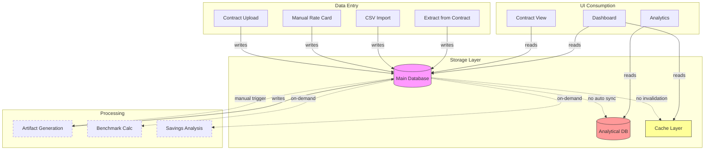

## Ideal State: Event-Driven Data Flows

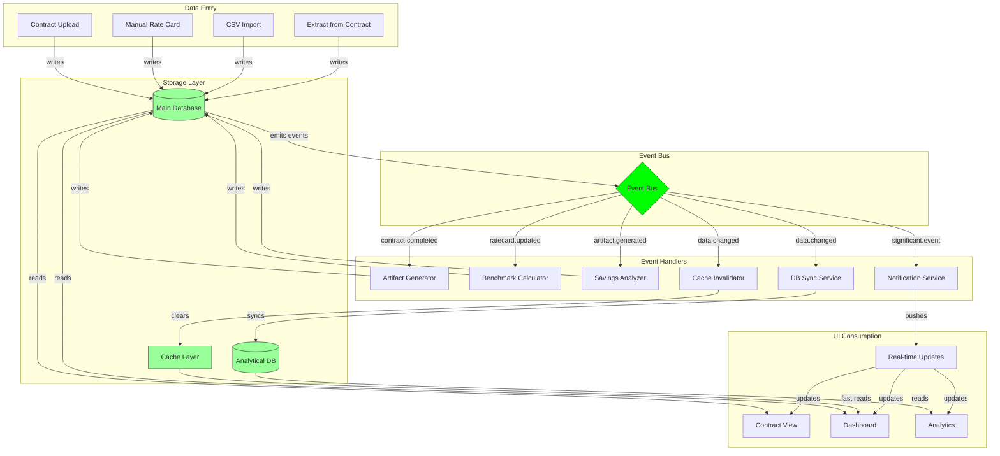

## Contract Upload Flow - Detailed

### Current State
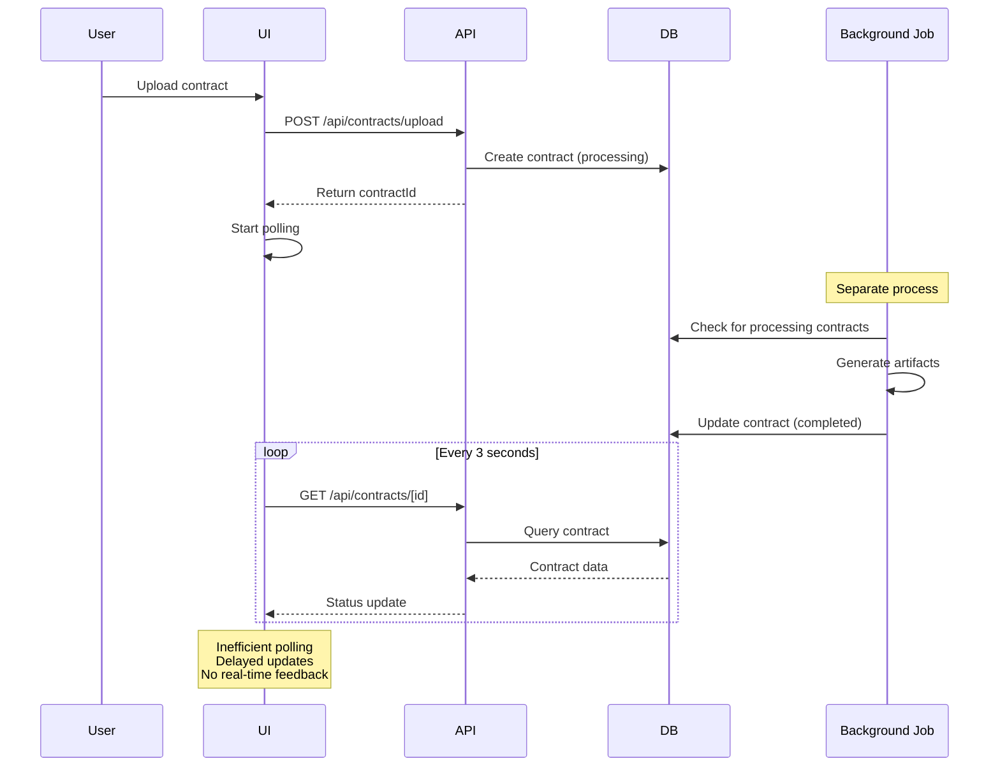

### Ideal State
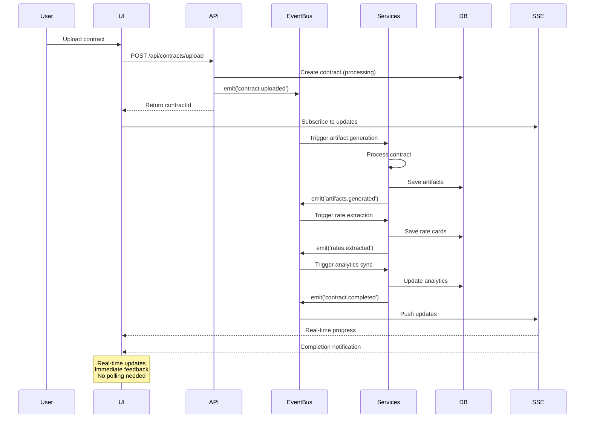

## Rate Card Edit Propagation

### Current State (Broken)
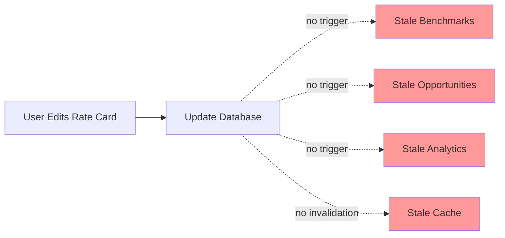

### Ideal State (Event-Driven)
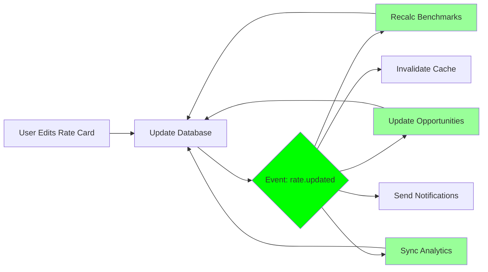

## Cache Invalidation Strategy

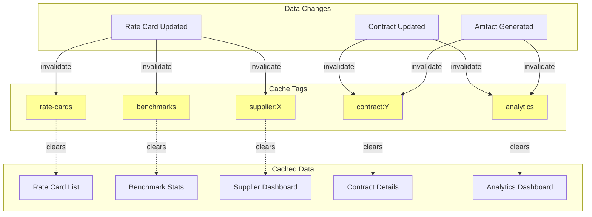

## Database Sync Flow

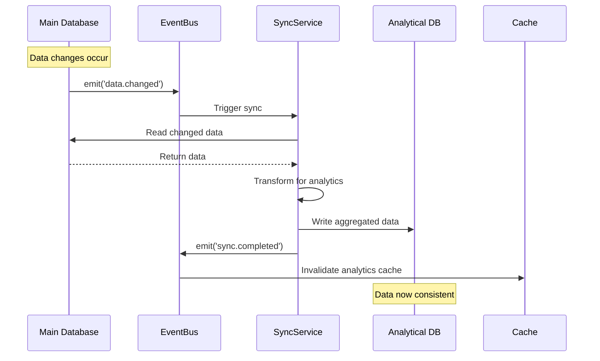

## Real-time Update Flow

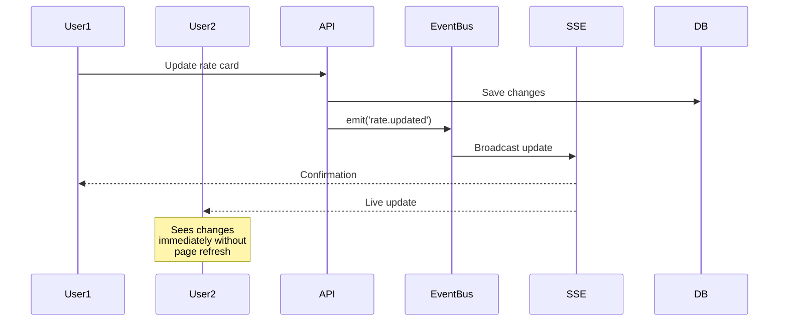

## Data Lineage Tracking

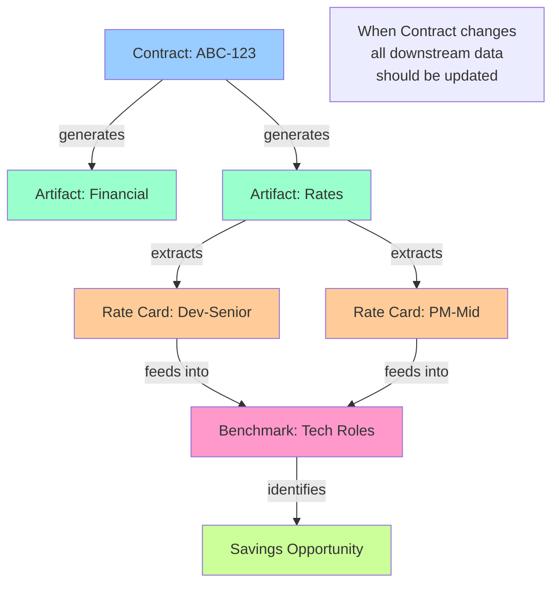

## Conflict Resolution Flow

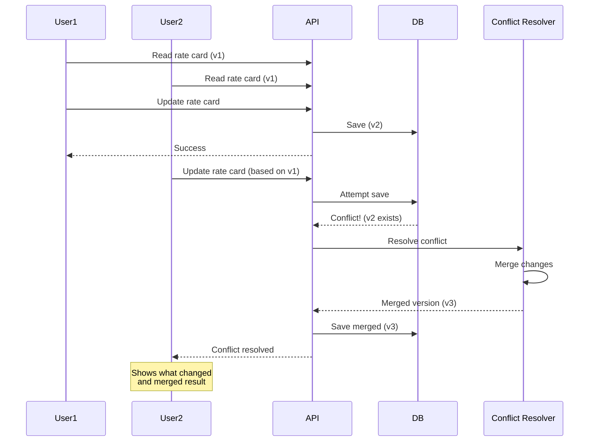

## Summary: Key Improvements Needed

1. **Event Bus Integration** - All data changes emit events
2. **Cache Invalidation** - Tag-based cache clearing
3. **Database Sync** - Automatic sync to analytical DB
4. **Real-time Updates** - SSE/WebSocket for live data
5. **Data Lineage** - Track dependencies and propagate changes
6. **Conflict Resolution** - Handle concurrent edits gracefully

These changes will transform the system from a collection of disconnected operations into a cohesive, real-time platform where data flows smoothly and stays consistent.
