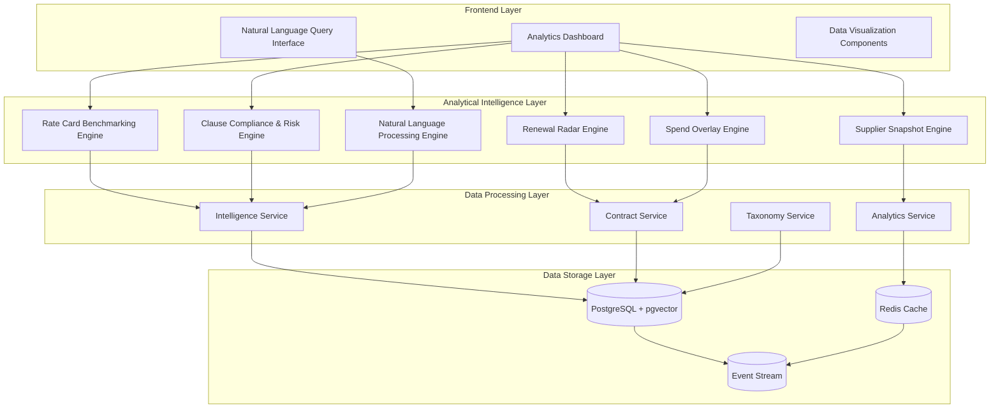

# Design Document

## Overview

The Analytical & Intelligence Layer transforms raw contract data into structured intelligence, providing automated benchmarking, risk assessment, compliance monitoring, and natural language querying capabilities. This layer builds upon the existing intelligence service infrastructure and extends it with specialized analytical engines for procurement intelligence.

The system leverages the current event-driven architecture, data orchestration layer, and real-time streaming capabilities to deliver comprehensive analytical insights across six core modules: Rate Card Benchmarking, Renewal Radar, Clause Compliance & Risk Scoring, Supplier Snapshot, Spend Overlay, and Natural Language Querying.

## Architecture

### High-Level Architecture



### Service Architecture

The analytical layer extends the existing data orchestration services with specialized analytical engines:

```typescript
interface AnalyticalIntelligenceService {
  rateCardBenchmarking: RateCardBenchmarkingEngine
  renewalRadar: RenewalRadarEngine
  clauseCompliance: ClauseComplianceEngine
  supplierSnapshot: SupplierSnapshotEngine
  spendOverlay: SpendOverlayEngine
  naturalLanguageQuery: NaturalLanguageQueryEngine
}
```

## Components and Interfaces

### 1. Rate Card Benchmarking Engine

**Purpose**: Automated rate analysis and benchmarking across suppliers and categories

**Core Components**:
- Rate Parser: Extracts and normalizes rate data from contracts
- Taxonomy Mapper: Maps roles to Chain IQ taxonomy
- Benchmark Calculator: Performs statistical analysis and cohort comparison
- Savings Estimator: Calculates potential savings opportunities

**Key Interfaces**:
```typescript
interface RateCardBenchmarkingEngine {
  parseRateCards(contractId: string): Promise<NormalizedRate[]>
  calculateBenchmarks(rates: NormalizedRate[], cohort: RateCohort): Promise<BenchmarkResult>
  estimateSavings(currentRates: NormalizedRate[], benchmarks: BenchmarkResult): Promise<SavingsOpportunity>
  generateRateCardReport(supplierId: string): Promise<RateCardReport>
}

interface NormalizedRate {
  role: string
  level: string
  rate: number
  currency: string
  region: string
  deliveryModel: 'onshore' | 'nearshore' | 'offshore'
  supplier: string
  effectiveDate: Date
}

interface BenchmarkResult {
  cohort: RateCohort
  statistics: {
    p25: number
    p50: number
    p75: number
    p90: number
    mean: number
    stdDev: number
  }
  sampleSize: number
  confidence: number
}
```

### 2. Renewal Radar Engine

**Purpose**: Proactive contract renewal monitoring and alerting

**Core Components**:
- Date Extractor: Identifies contract dates and renewal clauses
- Alert Manager: Manages renewal notifications and thresholds
- Calendar Generator: Creates renewal timeline views
- Integration Hub: Connects to RFx generation and calendar systems

**Key Interfaces**:
```typescript
interface RenewalRadarEngine {
  extractRenewalData(contractId: string): Promise<RenewalData>
  scheduleAlerts(renewalData: RenewalData): Promise<void>
  generateRenewalCalendar(filters: RenewalFilters): Promise<RenewalCalendar>
  triggerRfxGeneration(contractId: string): Promise<RfxEvent>
}

interface RenewalData {
  contractId: string
  startDate: Date
  endDate: Date
  renewalType: 'manual' | 'auto' | 'evergreen'
  noticePeriod: number
  autoRenewalClause: string
  riskLevel: 'low' | 'medium' | 'high'
}
```

### 3. Clause Compliance & Risk Engine

**Purpose**: Automated compliance reviews against organizational policies

**Core Components**:
- Policy Manager: Defines and manages compliance policies
- Clause Scanner: LLM-based clause identification and analysis
- Compliance Scorer: Calculates compliance scores and risk levels
- Recommendation Generator: Provides remediation suggestions

**Key Interfaces**:
```typescript
interface ClauseComplianceEngine {
  scanContract(contractId: string): Promise<ComplianceResult>
  updatePolicies(policies: CompliancePolicy[]): Promise<void>
  generateComplianceReport(filters: ComplianceFilters): Promise<ComplianceReport>
  recommendRemediation(complianceResult: ComplianceResult): Promise<RemediationPlan>
}

interface CompliancePolicy {
  clauseType: 'liability' | 'ip' | 'termination' | 'confidentiality' | 'gdpr' | 'audit' | 'esg'
  requirement: 'must' | 'should' | 'can'
  weight: number
  template: string
  validationRules: ValidationRule[]
}

interface ComplianceResult {
  contractId: string
  overallScore: number
  clauseResults: ClauseResult[]
  riskLevel: 'low' | 'medium' | 'high' | 'critical'
  recommendations: string[]
}
```

### 4. Supplier Snapshot Engine

**Purpose**: 360° supplier intelligence and analytics

**Core Components**:
- Data Aggregator: Consolidates supplier data from multiple sources
- External Integrator: Connects to Sievo, D&B, ESG data sources
- Analytics Calculator: Computes supplier metrics and scores
- AI Summarizer: Generates executive summaries

**Key Interfaces**:
```typescript
interface SupplierSnapshotEngine {
  aggregateSupplierData(supplierId: string): Promise<SupplierProfile>
  integrateExternalData(supplierId: string): Promise<ExternalSupplierData>
  calculateSupplierMetrics(profile: SupplierProfile): Promise<SupplierMetrics>
  generateExecutiveSummary(profile: SupplierProfile): Promise<ExecutiveSummary>
}

interface SupplierProfile {
  supplierId: string
  basicInfo: SupplierBasicInfo
  contracts: ContractSummary[]
  financialMetrics: FinancialMetrics
  performanceMetrics: PerformanceMetrics
  riskAssessment: RiskAssessment
  complianceStatus: ComplianceStatus
}
```

### 5. Spend Overlay Engine

**Purpose**: Integration with actual spend data for leakage detection

**Core Components**:
- Spend Integrator: Connects to Sievo and other spend systems
- Data Mapper: Maps spend lines to contracts
- Variance Analyzer: Identifies rate and volume discrepancies
- Efficiency Calculator: Computes utilization metrics

**Key Interfaces**:
```typescript
interface SpendOverlayEngine {
  integrateSpendData(source: SpendDataSource): Promise<SpendIntegrationResult>
  mapSpendToContracts(spendData: SpendData[]): Promise<SpendContractMapping[]>
  analyzeVariances(mappings: SpendContractMapping[]): Promise<VarianceAnalysis>
  calculateEfficiency(supplierId: string): Promise<EfficiencyMetrics>
}

interface SpendData {
  supplierId: string
  category: string
  costCenter: string
  amount: number
  currency: string
  period: string
  poReference?: string
  description?: string
}
```

### 6. Natural Language Query Engine

**Purpose**: Conversational interface for contract and benchmark queries

**Core Components**:
- Intent Classifier: Interprets user query intent
- RAG Pipeline: Hybrid search with semantic and keyword matching
- Response Generator: Formats structured responses with citations
- Context Manager: Maintains conversation history

**Key Interfaces**:
```typescript
interface NaturalLanguageQueryEngine {
  processQuery(query: string, context: QueryContext): Promise<QueryResponse>
  searchContracts(query: string, filters: SearchFilters): Promise<SearchResult[]>
  generateResponse(results: SearchResult[], query: string): Promise<StructuredResponse>
  maintainContext(sessionId: string, query: string, response: QueryResponse): Promise<void>
}

interface QueryResponse {
  answer: string
  confidence: number
  evidence: Evidence[]
  suggestions: string[]
  followUpQuestions: string[]
}

interface Evidence {
  contractId: string
  page?: number
  excerpt: string
  relevanceScore: number
}
```

## Data Models

### Core Analytical Data Models

```typescript
// Rate Card Models
interface RateCard {
  id: string
  contractId: string
  supplierId: string
  rates: Rate[]
  effectiveDate: Date
  currency: string
  region: string
  deliveryModel: string
}

interface Rate {
  role: string
  level: string
  hourlyRate: number
  dailyRate: number
  monthlyRate?: number
  billableHours?: number
}

// Benchmark Models
interface Benchmark {
  id: string
  cohort: RateCohort
  statistics: BenchmarkStatistics
  sampleSize: number
  confidence: number
  lastUpdated: Date
}

interface RateCohort {
  role: string
  level: string
  region: string
  deliveryModel: string
  category: string
}

// Renewal Models
interface RenewalAlert {
  id: string
  contractId: string
  alertType: 'renewal' | 'termination' | 'renegotiation'
  dueDate: Date
  daysUntilDue: number
  priority: 'low' | 'medium' | 'high' | 'critical'
  status: 'pending' | 'acknowledged' | 'actioned' | 'dismissed'
}

// Compliance Models
interface ComplianceScore {
  id: string
  contractId: string
  overallScore: number
  clauseScores: ClauseScore[]
  riskLevel: string
  lastAssessed: Date
}

interface ClauseScore {
  clauseType: string
  status: 'present' | 'weak' | 'missing'
  score: number
  weight: number
  findings: string[]
}

// Supplier Models
interface SupplierIntelligence {
  id: string
  supplierId: string
  financialHealth: number
  performanceScore: number
  riskScore: number
  complianceScore: number
  relationshipMetrics: RelationshipMetrics
  lastUpdated: Date
}

// Spend Models
interface SpendAnalysis {
  id: string
  supplierId: string
  period: string
  contractedSpend: number
  actualSpend: number
  variance: number
  variancePercentage: number
  leakageAmount: number
  utilizationRate: number
}
```

## Error Handling

### Error Categories and Strategies

1. **Data Integration Errors**
   - External API failures (Sievo, D&B)
   - Data format inconsistencies
   - Missing or incomplete data

2. **Processing Errors**
   - LLM service failures
   - Calculation errors
   - Timeout issues

3. **Business Logic Errors**
   - Invalid cohort definitions
   - Insufficient sample sizes
   - Policy validation failures

### Error Handling Implementation

```typescript
interface AnalyticalError {
  code: string
  message: string
  category: 'data' | 'processing' | 'business' | 'system'
  severity: 'low' | 'medium' | 'high' | 'critical'
  context: Record<string, any>
  retryable: boolean
}

class AnalyticalErrorHandler {
  async handleError(error: AnalyticalError): Promise<ErrorResponse> {
    // Log error with context
    logger.error({ error }, 'Analytical processing error')
    
    // Determine retry strategy
    if (error.retryable && error.severity !== 'critical') {
      return this.scheduleRetry(error)
    }
    
    // Fallback strategies
    switch (error.category) {
      case 'data':
        return this.handleDataError(error)
      case 'processing':
        return this.handleProcessingError(error)
      case 'business':
        return this.handleBusinessError(error)
      default:
        return this.handleSystemError(error)
    }
  }
}
```

## Testing Strategy

### Unit Testing
- Individual engine components
- Data transformation functions
- Calculation algorithms
- Error handling scenarios

### Integration Testing
- End-to-end analytical workflows
- External system integrations
- Event-driven processing
- Cache invalidation

### Performance Testing
- Large dataset processing
- Concurrent user scenarios
- Memory usage optimization
- Response time benchmarks

### Test Implementation Framework

```typescript
describe('Rate Card Benchmarking Engine', () => {
  describe('Rate Parsing', () => {
    it('should parse standard rate tables correctly')
    it('should handle currency conversions')
    it('should normalize role mappings')
    it('should validate rate data integrity')
  })
  
  describe('Benchmark Calculations', () => {
    it('should calculate statistical distributions')
    it('should handle insufficient sample sizes')
    it('should apply cohort relaxation logic')
    it('should generate confidence scores')
  })
  
  describe('Savings Estimation', () => {
    it('should calculate potential savings accurately')
    it('should handle edge cases and outliers')
    it('should provide actionable recommendations')
  })
})
```

### Mock Data Strategy
- Comprehensive test datasets for each analytical engine
- Realistic contract and rate card samples
- External API response mocks
- Performance test data generators## Im
plementation Architecture

### Service Layer Extensions

The analytical intelligence layer extends the existing `IntelligenceService` with specialized engines:

```typescript
// Extended Intelligence Service
export class AnalyticalIntelligenceService extends IntelligenceService {
  private rateCardEngine: RateCardBenchmarkingEngine
  private renewalEngine: RenewalRadarEngine
  private complianceEngine: ClauseComplianceEngine
  private supplierEngine: SupplierSnapshotEngine
  private spendEngine: SpendOverlayEngine
  private nlqEngine: NaturalLanguageQueryEngine

  constructor() {
    super()
    this.initializeEngines()
  }

  private initializeEngines(): void {
    this.rateCardEngine = new RateCardBenchmarkingEngine(this.dbAdaptor, this.cacheAdaptor)
    this.renewalEngine = new RenewalRadarEngine(this.dbAdaptor, this.eventBus)
    this.complianceEngine = new ClauseComplianceEngine(this.dbAdaptor, this.llmService)
    this.supplierEngine = new SupplierSnapshotEngine(this.dbAdaptor, this.externalIntegrations)
    this.spendEngine = new SpendOverlayEngine(this.dbAdaptor, this.spendIntegrations)
    this.nlqEngine = new NaturalLanguageQueryEngine(this.dbAdaptor, this.vectorSearch)
  }
}
```

### Database Schema Extensions

```sql
-- Rate Card Tables
CREATE TABLE rate_cards (
    id UUID PRIMARY KEY DEFAULT gen_random_uuid(),
    contract_id UUID REFERENCES contracts(id),
    supplier_id UUID,
    effective_date DATE NOT NULL,
    currency VARCHAR(3) NOT NULL,
    region VARCHAR(100),
    delivery_model VARCHAR(50),
    created_at TIMESTAMP DEFAULT NOW(),
    updated_at TIMESTAMP DEFAULT NOW()
);

CREATE TABLE rates (
    id UUID PRIMARY KEY DEFAULT gen_random_uuid(),
    rate_card_id UUID REFERENCES rate_cards(id),
    role VARCHAR(200) NOT NULL,
    level VARCHAR(100),
    hourly_rate DECIMAL(10,2),
    daily_rate DECIMAL(10,2),
    monthly_rate DECIMAL(10,2),
    billable_hours INTEGER DEFAULT 8,
    created_at TIMESTAMP DEFAULT NOW()
);

-- Benchmark Tables
CREATE TABLE benchmarks (
    id UUID PRIMARY KEY DEFAULT gen_random_uuid(),
    cohort_hash VARCHAR(64) UNIQUE NOT NULL,
    role VARCHAR(200) NOT NULL,
    level VARCHAR(100),
    region VARCHAR(100),
    delivery_model VARCHAR(50),
    category VARCHAR(100),
    p25 DECIMAL(10,2),
    p50 DECIMAL(10,2),
    p75 DECIMAL(10,2),
    p90 DECIMAL(10,2),
    mean DECIMAL(10,2),
    std_dev DECIMAL(10,2),
    sample_size INTEGER,
    confidence DECIMAL(5,2),
    last_updated TIMESTAMP DEFAULT NOW()
);

-- Renewal Tables
CREATE TABLE renewal_alerts (
    id UUID PRIMARY KEY DEFAULT gen_random_uuid(),
    contract_id UUID REFERENCES contracts(id),
    alert_type VARCHAR(50) NOT NULL,
    due_date DATE NOT NULL,
    days_until_due INTEGER,
    priority VARCHAR(20) NOT NULL,
    status VARCHAR(20) DEFAULT 'pending',
    created_at TIMESTAMP DEFAULT NOW(),
    acknowledged_at TIMESTAMP,
    actioned_at TIMESTAMP
);

-- Compliance Tables
CREATE TABLE compliance_policies (
    id UUID PRIMARY KEY DEFAULT gen_random_uuid(),
    tenant_id UUID NOT NULL,
    clause_type VARCHAR(50) NOT NULL,
    requirement VARCHAR(10) NOT NULL,
    weight DECIMAL(3,2) NOT NULL,
    template TEXT,
    validation_rules JSONB,
    created_at TIMESTAMP DEFAULT NOW(),
    updated_at TIMESTAMP DEFAULT NOW()
);

CREATE TABLE compliance_scores (
    id UUID PRIMARY KEY DEFAULT gen_random_uuid(),
    contract_id UUID REFERENCES contracts(id),
    overall_score DECIMAL(5,2) NOT NULL,
    risk_level VARCHAR(20) NOT NULL,
    clause_scores JSONB NOT NULL,
    recommendations TEXT[],
    last_assessed TIMESTAMP DEFAULT NOW()
);

-- Supplier Intelligence Tables
CREATE TABLE supplier_intelligence (
    id UUID PRIMARY KEY DEFAULT gen_random_uuid(),
    supplier_id UUID NOT NULL,
    tenant_id UUID NOT NULL,
    financial_health DECIMAL(5,2),
    performance_score DECIMAL(5,2),
    risk_score DECIMAL(5,2),
    compliance_score DECIMAL(5,2),
    relationship_metrics JSONB,
    external_data JSONB,
    ai_summary TEXT,
    last_updated TIMESTAMP DEFAULT NOW()
);

-- Spend Analysis Tables
CREATE TABLE spend_data (
    id UUID PRIMARY KEY DEFAULT gen_random_uuid(),
    tenant_id UUID NOT NULL,
    supplier_id UUID,
    category VARCHAR(200),
    cost_center VARCHAR(100),
    amount DECIMAL(12,2) NOT NULL,
    currency VARCHAR(3) NOT NULL,
    period VARCHAR(20) NOT NULL,
    po_reference VARCHAR(100),
    description TEXT,
    source VARCHAR(50) NOT NULL,
    imported_at TIMESTAMP DEFAULT NOW()
);

CREATE TABLE spend_analysis (
    id UUID PRIMARY KEY DEFAULT gen_random_uuid(),
    supplier_id UUID NOT NULL,
    tenant_id UUID NOT NULL,
    period VARCHAR(20) NOT NULL,
    contracted_spend DECIMAL(12,2),
    actual_spend DECIMAL(12,2),
    variance DECIMAL(12,2),
    variance_percentage DECIMAL(5,2),
    leakage_amount DECIMAL(12,2),
    utilization_rate DECIMAL(5,2),
    analyzed_at TIMESTAMP DEFAULT NOW()
);

-- Query History Tables
CREATE TABLE query_history (
    id UUID PRIMARY KEY DEFAULT gen_random_uuid(),
    session_id UUID NOT NULL,
    tenant_id UUID NOT NULL,
    user_id UUID,
    query TEXT NOT NULL,
    response JSONB NOT NULL,
    confidence DECIMAL(5,2),
    response_time INTEGER,
    created_at TIMESTAMP DEFAULT NOW()
);

-- Indexes for Performance
CREATE INDEX idx_rate_cards_contract_id ON rate_cards(contract_id);
CREATE INDEX idx_rates_rate_card_id ON rates(rate_card_id);
CREATE INDEX idx_benchmarks_cohort ON benchmarks(role, level, region, delivery_model);
CREATE INDEX idx_renewal_alerts_due_date ON renewal_alerts(due_date);
CREATE INDEX idx_compliance_scores_contract_id ON compliance_scores(contract_id);
CREATE INDEX idx_supplier_intelligence_supplier_id ON supplier_intelligence(supplier_id);
CREATE INDEX idx_spend_data_supplier_period ON spend_data(supplier_id, period);
CREATE INDEX idx_query_history_session ON query_history(session_id, created_at);
```

### Event-Driven Processing

```typescript
// Analytical Events
export enum AnalyticalEvents {
  RATE_CARD_PARSED = 'rate_card_parsed',
  BENCHMARK_UPDATED = 'benchmark_updated',
  RENEWAL_ALERT_TRIGGERED = 'renewal_alert_triggered',
  COMPLIANCE_SCORED = 'compliance_scored',
  SUPPLIER_PROFILE_UPDATED = 'supplier_profile_updated',
  SPEND_VARIANCE_DETECTED = 'spend_variance_detected',
  QUERY_PROCESSED = 'query_processed'
}

// Event Handlers
export class AnalyticalEventHandlers {
  @EventHandler(AnalyticalEvents.RATE_CARD_PARSED)
  async handleRateCardParsed(event: RateCardParsedEvent): Promise<void> {
    // Update benchmarks
    await this.rateCardEngine.updateBenchmarks(event.rateCard)
    
    // Trigger savings analysis
    await this.rateCardEngine.analyzeSavingsOpportunities(event.contractId)
    
    // Emit benchmark update event
    await this.eventBus.publish(AnalyticalEvents.BENCHMARK_UPDATED, {
      cohort: event.cohort,
      updatedAt: new Date()
    })
  }

  @EventHandler(AnalyticalEvents.COMPLIANCE_SCORED)
  async handleComplianceScored(event: ComplianceScoredEvent): Promise<void> {
    // Update supplier intelligence
    await this.supplierEngine.updateComplianceMetrics(
      event.supplierId, 
      event.complianceScore
    )
    
    // Generate alerts for critical issues
    if (event.riskLevel === 'critical') {
      await this.alertService.createComplianceAlert(event)
    }
  }
}
```

### API Endpoints

```typescript
// Rate Card Benchmarking APIs
@Controller('/api/analytics/rate-benchmarking')
export class RateBenchmarkingController {
  @Get('/benchmarks')
  async getBenchmarks(@Query() filters: BenchmarkFilters): Promise<BenchmarkResult[]> {
    return this.analyticalService.rateCardEngine.getBenchmarks(filters)
  }

  @Get('/savings-opportunities')
  async getSavingsOpportunities(@Query() filters: SavingsFilters): Promise<SavingsOpportunity[]> {
    return this.analyticalService.rateCardEngine.getSavingsOpportunities(filters)
  }

  @Post('/analyze-contract/:id')
  async analyzeContract(@Param('id') contractId: string): Promise<RateAnalysisResult> {
    return this.analyticalService.rateCardEngine.analyzeContract(contractId)
  }
}

// Renewal Radar APIs
@Controller('/api/analytics/renewal-radar')
export class RenewalRadarController {
  @Get('/alerts')
  async getRenewalAlerts(@Query() filters: RenewalFilters): Promise<RenewalAlert[]> {
    return this.analyticalService.renewalEngine.getAlerts(filters)
  }

  @Get('/calendar')
  async getRenewalCalendar(@Query() filters: CalendarFilters): Promise<RenewalCalendar> {
    return this.analyticalService.renewalEngine.getCalendar(filters)
  }

  @Post('/schedule-rfx/:contractId')
  async scheduleRfx(@Param('contractId') contractId: string): Promise<RfxEvent> {
    return this.analyticalService.renewalEngine.scheduleRfx(contractId)
  }
}

// Natural Language Query APIs
@Controller('/api/analytics/query')
export class QueryController {
  @Post('/ask')
  async processQuery(@Body() request: QueryRequest): Promise<QueryResponse> {
    return this.analyticalService.nlqEngine.processQuery(request.query, request.context)
  }

  @Get('/suggestions')
  async getQuerySuggestions(@Query('partial') partial: string): Promise<string[]> {
    return this.analyticalService.nlqEngine.getQuerySuggestions(partial)
  }

  @Get('/history/:sessionId')
  async getQueryHistory(@Param('sessionId') sessionId: string): Promise<QueryHistory[]> {
    return this.analyticalService.nlqEngine.getQueryHistory(sessionId)
  }
}
```

### Caching Strategy

```typescript
// Cache Keys and TTL Configuration
export const CacheConfig = {
  BENCHMARKS: {
    key: (cohort: RateCohort) => `benchmark:${cohort.role}:${cohort.level}:${cohort.region}`,
    ttl: 3600 // 1 hour
  },
  SUPPLIER_INTELLIGENCE: {
    key: (supplierId: string) => `supplier:${supplierId}:intelligence`,
    ttl: 1800 // 30 minutes
  },
  COMPLIANCE_SCORES: {
    key: (contractId: string) => `compliance:${contractId}:score`,
    ttl: 7200 // 2 hours
  },
  SPEND_ANALYSIS: {
    key: (supplierId: string, period: string) => `spend:${supplierId}:${period}`,
    ttl: 3600 // 1 hour
  },
  QUERY_RESULTS: {
    key: (queryHash: string) => `query:${queryHash}:result`,
    ttl: 900 // 15 minutes
  }
}

// Cache Invalidation Strategy
export class AnalyticalCacheManager {
  async invalidateOnContractUpdate(contractId: string): Promise<void> {
    // Invalidate related benchmarks
    const contract = await this.contractService.getContract(contractId)
    if (contract.rateCard) {
      await this.invalidateBenchmarkCache(contract.rateCard.cohort)
    }
    
    // Invalidate supplier intelligence
    if (contract.supplierId) {
      await this.invalidateSupplierCache(contract.supplierId)
    }
    
    // Invalidate compliance scores
    await this.invalidateComplianceCache(contractId)
  }
}
```

### Performance Optimization

```typescript
// Batch Processing for Large Datasets
export class BatchProcessor {
  async processBenchmarkUpdates(rateCards: RateCard[]): Promise<void> {
    const batches = this.chunkArray(rateCards, 100)
    
    for (const batch of batches) {
      await Promise.all(
        batch.map(rateCard => this.processSingleRateCard(rateCard))
      )
      
      // Small delay to prevent overwhelming the system
      await this.delay(100)
    }
  }

  async processSupplierIntelligenceUpdates(supplierIds: string[]): Promise<void> {
    const batches = this.chunkArray(supplierIds, 50)
    
    for (const batch of batches) {
      await Promise.all(
        batch.map(supplierId => this.updateSupplierIntelligence(supplierId))
      )
    }
  }
}

// Query Optimization
export class QueryOptimizer {
  async optimizeBenchmarkQuery(filters: BenchmarkFilters): Promise<string> {
    // Use materialized views for common benchmark queries
    if (this.isCommonBenchmarkQuery(filters)) {
      return this.getOptimizedBenchmarkQuery(filters)
    }
    
    // Use indexed queries for specific lookups
    return this.getIndexedBenchmarkQuery(filters)
  }

  async optimizeSupplierQuery(supplierId: string): Promise<SupplierProfile> {
    // Check cache first
    const cached = await this.cacheAdaptor.get(`supplier:${supplierId}:profile`)
    if (cached) return cached
    
    // Use single query with joins to minimize database round trips
    const profile = await this.getSupplierProfileOptimized(supplierId)
    
    // Cache result
    await this.cacheAdaptor.set(`supplier:${supplierId}:profile`, profile, 1800)
    
    return profile
  }
}
```

This comprehensive design provides the foundation for implementing the Analytical & Intelligence Layer with proper architecture, data models, error handling, and performance considerations. The design leverages the existing infrastructure while adding specialized analytical capabilities.