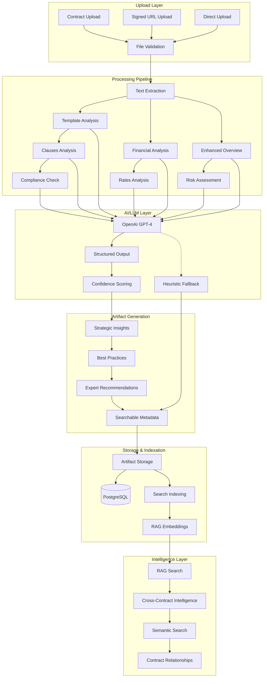
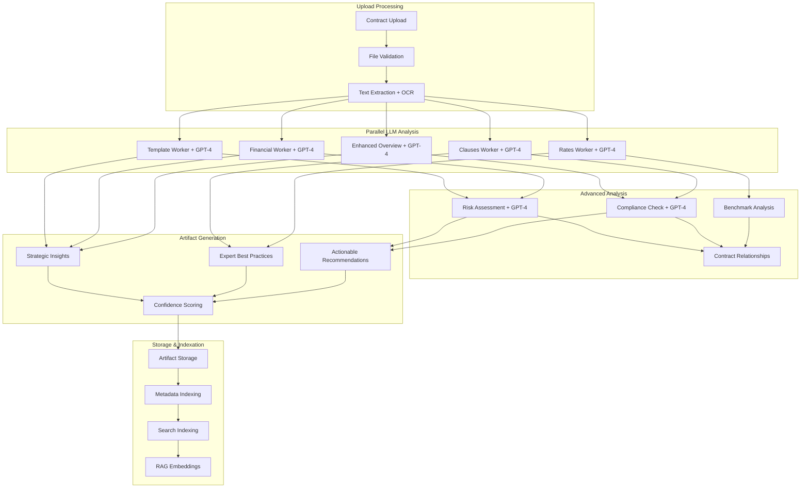

# Contract Intelligence System Improvements - Design Document

## Overview

This design document outlines the harmonized architecture for a state-of-the-art AI Contract Lifecycle Management (CLM) system. The design ensures seamless contract upload → ingestion → PDF analysis → artifacts population → data storage and indexation, with enhanced overview insights and expert-level best practices. The system leverages your existing sophisticated database schema, LLM-powered workers, and comprehensive testing framework while addressing identified gaps for production readiness.

## Architecture

### Complete Upload-to-Insights Architecture



### Enhanced LLM-Powered Worker Architecture



## Components and Interfaces

### 1. Enhanced Upload and Processing Layer

#### Upload Flow Architecture
```typescript
interface UploadFlowManager {
  // Signed URL upload flow
  initSignedUpload(request: SignedUploadRequest): Promise<SignedUploadResponse>;
  finalizeUpload(request: FinalizeUploadRequest): Promise<UploadResult>;
  
  // Direct upload flow
  processDirectUpload(file: UploadedFile, metadata: UploadMetadata): Promise<UploadResult>;
  
  // File validation and processing
  validateFile(file: FileInfo): Promise<ValidationResult>;
  extractContent(file: FileInfo): Promise<ContentExtractionResult>;
  
  // Pipeline orchestration
  enqueueAnalysisPipeline(contractId: string, tenantId: string): Promise<PipelineResult>;
  trackProgress(contractId: string): Promise<ProgressStatus>;
}

interface ContentExtractionResult {
  text: string;
  metadata: {
    pageCount?: number;
    ocrConfidence?: number;
    language?: string;
    encoding?: string;
  };
  structure: {
    sections: DocumentSection[];
    tables: TableData[];
    signatures: SignatureInfo[];
  };
  confidence: number;
}

interface PipelineResult {
  pipelineId: string;
  stages: PipelineStage[];
  estimatedDuration: number;
  priority: number;
}

interface ProgressStatus {
  contractId: string;
  currentStage: string;
  completedStages: string[];
  progress: number; // 0-100
  estimatedTimeRemaining: number;
  errors: ProcessingError[];
}
```

### 2. Complete LLM Worker Integration Layer

#### Enhanced Worker Architecture
```typescript
interface LLMWorkerBase {
  // Core LLM integration
  openaiClient: OpenAI;
  model: string; // GPT-4 or GPT-4-turbo
  
  // Processing methods
  process(job: WorkerJob): Promise<WorkerResult>;
  generateStructuredOutput<T>(prompt: string, schema: JSONSchema): Promise<T>;
  calculateConfidence(result: any): number;
  
  // Fallback and error handling
  fallbackAnalysis(content: string): Promise<Partial<WorkerResult>>;
  handleError(error: Error, context: WorkerContext): Promise<ErrorRecoveryResult>;
  
  // Best practices generation
  generateBestPractices(analysis: any, context: WorkerContext): Promise<BestPracticesResult>;
}

interface EnhancedOverviewWorker extends LLMWorkerBase {
  // Strategic analysis
  generateStrategicInsights(content: string, overview: any): Promise<StrategicInsight[]>;
  generateRelationshipGuidance(parties: ContractParty[], content: string): Promise<RelationshipGuidance>;
  generatePerformanceOptimization(overview: any): Promise<PerformanceOptimization>;
  
  // Expert recommendations
  generateGovernanceRecommendations(contractType: string, value: number): Promise<GovernanceRecommendation[]>;
  generateCommunicationProtocols(parties: ContractParty[]): Promise<CommunicationProtocol[]>;
  generateRiskMitigationStrategies(risks: RiskFactor[]): Promise<RiskMitigationStrategy[]>;
}

interface FinancialWorker extends LLMWorkerBase {
  // Comprehensive financial analysis
  extractFinancialData(content: string): Promise<FinancialAnalysisResult>;
  analyzeCostStructure(financialData: any): Promise<CostStructureAnalysis>;
  generatePaymentOptimization(paymentTerms: PaymentTerms): Promise<PaymentOptimization[]>;
  
  // Expert financial guidance
  generateFinancialBestPractices(analysis: FinancialAnalysisResult): Promise<FinancialBestPractices>;
  benchmarkAgainstIndustry(financialData: any, contractType: string): Promise<IndustryBenchmark>;
  generateNegotiationTips(financialTerms: any): Promise<NegotiationTip[]>;
}

interface TemplateWorker extends LLMWorkerBase {
  // Template analysis and compliance
  detectTemplates(content: string): Promise<TemplateDetectionResult>;
  analyzeCompliance(content: string, templates: Template[]): Promise<ComplianceAnalysisResult>;
  generateStandardizationRecommendations(deviations: Deviation[]): Promise<StandardizationRecommendation[]>;
  
  // Template optimization
  suggestTemplateImprovements(template: Template, usage: TemplateUsage): Promise<TemplateImprovement[]>;
  generateCustomTemplates(contractType: string, requirements: any): Promise<CustomTemplate>;
}
```

### 3. Enhanced Artifact Population and Storage Layer

#### Comprehensive Artifact Management
```typescript
interface ArtifactPopulationManager {
  // Core artifact creation
  createEnhancedOverviewArtifact(contractId: string, analysis: OverviewAnalysisResult): Promise<Artifact>;
  createFinancialArtifact(contractId: string, analysis: FinancialAnalysisResult): Promise<Artifact>;
  createTemplateArtifact(contractId: string, analysis: TemplateAnalysisResult): Promise<Artifact>;
  
  // Best practices integration
  enrichWithBestPractices(artifact: Artifact, bestPractices: BestPracticesResult): Promise<EnrichedArtifact>;
  generateActionableRecommendations(artifacts: Artifact[]): Promise<ActionableRecommendation[]>;
  
  // Cross-contract intelligence
  identifyContractRelationships(contractId: string, existingContracts: Contract[]): Promise<ContractRelationship[]>;
  generateBenchmarkInsights(contractId: string, similarContracts: Contract[]): Promise<BenchmarkInsight[]>;
  
  // Search and indexation
  createSearchableMetadata(artifact: Artifact): Promise<SearchableMetadata>;
  generateSemanticEmbeddings(content: string): Promise<VectorEmbedding>;
  updateSearchIndexes(contractId: string, artifacts: Artifact[]): Promise<IndexUpdateResult>;
}

interface EnrichedArtifact extends Artifact {
  bestPractices: {
    strategicGuidance: string[];
    relationshipManagement: string[];
    performanceOptimization: string[];
    governanceRecommendations: string[];
    communicationProtocols: string[];
    riskMitigationStrategies: string[];
  };
  confidence: number;
  expertInsights: ExpertInsight[];
  actionableRecommendations: ActionableRecommendation[];
  industryBenchmarks: IndustryBenchmark[];
}

interface SearchableMetadata {
  contractId: string;
  tenantId: string;
  searchableFields: {
    parties: string[];
    contractType: string;
    keyTerms: string[];
    financialTerms: string[];
    riskFactors: string[];
    complianceAreas: string[];
  };
  semanticTags: string[];
  relationships: ContractRelationship[];
  lastIndexed: Date;
}
```

### 4. Advanced RAG Search and Intelligence Layer

#### Cross-Contract Intelligence System
```typescript
interface CrossContractIntelligenceManager {
  // Semantic search capabilities
  performSemanticSearch(query: string, tenantId: string, options: SearchOptions): Promise<SearchResult[]>;
  findSimilarContracts(contractId: string, similarity: number): Promise<SimilarContract[]>;
  identifyContractPatterns(tenantId: string, criteria: PatternCriteria): Promise<ContractPattern[]>;
  
  // Relationship analysis
  analyzeContractRelationships(contractIds: string[]): Promise<RelationshipAnalysis>;
  generateRelationshipMap(tenantId: string): Promise<RelationshipMap>;
  identifyContractDependencies(contractId: string): Promise<ContractDependency[]>;
  
  // Intelligence insights
  generatePortfolioInsights(tenantId: string): Promise<PortfolioInsight[]>;
  identifyOptimizationOpportunities(tenantId: string): Promise<OptimizationOpportunity[]>;
  generateComplianceReport(tenantId: string, regulations: string[]): Promise<ComplianceReport>;
  
  // Benchmarking and analytics
  benchmarkContract(contractId: string, industry: string): Promise<BenchmarkResult>;
  generateTrendAnalysis(tenantId: string, timeRange: TimeRange): Promise<TrendAnalysis>;
  identifyAnomalies(tenantId: string): Promise<ContractAnomaly[]>;
}

interface SearchResult {
  contractId: string;
  relevanceScore: number;
  matchedContent: string[];
  context: SearchContext;
  highlights: TextHighlight[];
  relatedArtifacts: ArtifactReference[];
}

interface ContractPattern {
  patternType: string;
  description: string;
  frequency: number;
  contracts: string[];
  riskLevel: 'low' | 'medium' | 'high';
  recommendations: string[];
}

interface PortfolioInsight {
  category: 'financial' | 'risk' | 'compliance' | 'operational';
  title: string;
  description: string;
  impact: 'low' | 'medium' | 'high';
  affectedContracts: string[];
  recommendedActions: string[];
  potentialSavings?: number;
}
```

### 5. Production-Ready Error Handling and Monitoring

#### Comprehensive Error Management System
```typescript
interface ErrorHandlingManager {
  // Error classification and handling
  classifyError(error: Error, context: ErrorContext): ErrorClassification;
  handleWorkerError(workerId: string, error: Error, job: WorkerJob): Promise<ErrorRecoveryResult>;
  handleDatabaseError(operation: string, error: Error): Promise<DatabaseRecoveryResult>;
  handleLLMError(model: string, error: Error, fallback: boolean): Promise<LLMRecoveryResult>;
  
  // Recovery mechanisms
  attemptRecovery(error: ClassifiedError): Promise<RecoveryResult>;
  implementCircuitBreaker(service: string, failureThreshold: number): Promise<CircuitBreakerResult>;
  executeRetryPolicy(operation: () => Promise<any>, policy: RetryPolicy): Promise<any>;
  
  // Monitoring and alerting
  trackSystemHealth(): Promise<HealthMetrics>;
  generateAlerts(metrics: HealthMetrics): Promise<Alert[]>;
  createIncidentReport(error: CriticalError): Promise<IncidentReport>;
}

interface ErrorRecoveryResult {
  recovered: boolean;
  fallbackUsed: boolean;
  partialResults?: any;
  retryRecommended: boolean;
  userMessage: string;
  technicalDetails: string;
}

interface HealthMetrics {
  systemStatus: 'healthy' | 'degraded' | 'critical';
  componentHealth: {
    database: ComponentHealth;
    workers: ComponentHealth;
    llmServices: ComponentHealth;
    storage: ComponentHealth;
    cache: ComponentHealth;
  };
  performanceMetrics: {
    averageResponseTime: number;
    throughput: number;
    errorRate: number;
    queueDepth: number;
  };
  resourceUtilization: {
    cpu: number;
    memory: number;
    storage: number;
    networkIO: number;
  };
}

interface ComponentHealth {
  status: 'healthy' | 'degraded' | 'critical' | 'offline';
  lastCheck: Date;
  responseTime: number;
  errorCount: number;
  uptime: number;
}
```

### 3. Security Architecture

#### Authentication and Authorization
```typescript
interface SecurityConfig {
  jwt: {
    secret: string;
    expirationTime: string;
    refreshTokenExpiration: string;
  };
  rateLimiting: {
    windowMs: number;
    maxRequests: number;
    skipSuccessfulRequests: boolean;
  };
  encryption: {
    algorithm: string;
    keyLength: number;
    saltRounds: number;
  };
}

interface AuthenticationService {
  async authenticate(credentials: UserCredentials): Promise<AuthenticationResult>;
  async validateToken(token: string): Promise<TokenValidationResult>;
  async refreshToken(refreshToken: string): Promise<TokenRefreshResult>;
  async revokeToken(token: string): Promise<void>;
}

interface AuthorizationService {
  async checkPermission(user: User, resource: string, action: string): Promise<boolean>;
  async getTenantPermissions(userId: string, tenantId: string): Promise<Permission[]>;
  async enforceRateLimit(userId: string, endpoint: string): Promise<RateLimitResult>;
}
```

#### Security Middleware Stack
```typescript
interface SecurityMiddleware {
  rateLimiter: RateLimiterMiddleware;
  xssProtection: XSSProtectionMiddleware;
  sqlInjectionProtection: SQLInjectionMiddleware;
  inputValidation: InputValidationMiddleware;
  securityHeaders: SecurityHeadersMiddleware;
  auditLogging: AuditLoggingMiddleware;
}

class SecurityHeadersMiddleware {
  apply(): SecurityHeaders {
    return {
      'X-Frame-Options': 'DENY',
      'X-Content-Type-Options': 'nosniff',
      'X-XSS-Protection': '1; mode=block',
      'Strict-Transport-Security': 'max-age=31536000; includeSubDomains',
      'Content-Security-Policy': this.generateCSP(),
      'Referrer-Policy': 'strict-origin-when-cross-origin'
    };
  }
}
```

### 4. Testing Framework Architecture

#### Test Structure
```typescript
interface TestingFramework {
  unitTests: UnitTestSuite;
  integrationTests: IntegrationTestSuite;
  e2eTests: E2ETestSuite;
  performanceTests: PerformanceTestSuite;
  securityTests: SecurityTestSuite;
}

interface TestConfiguration {
  coverage: {
    threshold: number;
    excludePatterns: string[];
    reportFormats: string[];
  };
  performance: {
    maxResponseTime: number;
    maxMemoryUsage: number;
    concurrentUsers: number;
  };
  security: {
    vulnerabilityScanning: boolean;
    penetrationTesting: boolean;
    dependencyAuditing: boolean;
  };
}
```

#### Test Data Management
```typescript
interface TestDataManager {
  async setupTestData(): Promise<void>;
  async cleanupTestData(): Promise<void>;
  async createTestContract(template: ContractTemplate): Promise<TestContract>;
  async createTestTenant(config: TenantConfig): Promise<TestTenant>;
  async seedDatabase(fixtures: DatabaseFixtures): Promise<void>;
}
```

### 5. SharePoint Integration Architecture

#### SharePoint Service Layer
```typescript
interface SharePointIntegration {
  documentSync: SharePointDocumentSync;
  authentication: SharePointAuth;
  webhooks: SharePointWebhooks;
  userInterface: SharePointUI;
}

interface SharePointDocumentSync {
  async syncDocument(documentId: string): Promise<SyncResult>;
  async uploadAnalysisResults(contractId: string, results: AnalysisResults): Promise<void>;
  async monitorDocumentChanges(): Promise<DocumentChange[]>;
  async handleDocumentUpdate(change: DocumentChange): Promise<void>;
}

interface SharePointAuth {
  async authenticateUser(token: string): Promise<SharePointUser>;
  async validatePermissions(user: SharePointUser, resource: string): Promise<boolean>;
  async refreshAccessToken(refreshToken: string): Promise<TokenResult>;
}
```

#### SPFx Web Part Architecture
```typescript
interface ContractIntelligenceWebPart {
  properties: WebPartProperties;
  context: WebPartContext;
  
  render(): void;
  onPropertyPaneFieldChanged(propertyPath: string, oldValue: any, newValue: any): void;
  getPropertyPaneConfiguration(): IPropertyPaneConfiguration;
}

interface WebPartProperties {
  apiEndpoint: string;
  tenantId: string;
  enableRealTimeSync: boolean;
  displayOptions: DisplayOptions;
}
```

### 6. Monitoring and Observability

#### Metrics Collection
```typescript
interface MetricsCollector {
  async recordMetric(name: string, value: number, tags?: Record<string, string>): Promise<void>;
  async recordTimer(name: string, duration: number, tags?: Record<string, string>): Promise<void>;
  async recordCounter(name: string, increment?: number, tags?: Record<string, string>): Promise<void>;
  async recordGauge(name: string, value: number, tags?: Record<string, string>): Promise<void>;
}

interface HealthCheckService {
  async checkDatabaseHealth(): Promise<HealthStatus>;
  async checkRedisHealth(): Promise<HealthStatus>;
  async checkStorageHealth(): Promise<HealthStatus>;
  async checkAIServicesHealth(): Promise<HealthStatus>;
  async getOverallHealth(): Promise<SystemHealth>;
}
```

#### Distributed Tracing
```typescript
interface TracingService {
  async startTrace(operationName: string, parentSpan?: Span): Promise<Span>;
  async finishTrace(span: Span, result?: any, error?: Error): Promise<void>;
  async addTraceTag(span: Span, key: string, value: string): Promise<void>;
  async getTraceContext(): Promise<TraceContext>;
}
```

## Enhanced Data Models

### Complete Contract Intelligence Data Models
```typescript
interface EnhancedContract {
  id: string;
  tenantId: string;
  filename: string;
  originalName: string;
  contentType: string;
  size: number;
  checksum: string;
  
  // Processing status
  status: ContractStatus;
  processingStatus: ProcessingStatus;
  uploadedAt: Date;
  processedAt?: Date;
  lastAnalyzedAt?: Date;
  
  // Enhanced metadata
  metadata: EnhancedContractMetadata;
  
  // Complete analysis results
  analysisResults: ComprehensiveAnalysisResults;
  
  // Intelligence and relationships
  relationships: ContractRelationship[];
  insights: ContractInsight[];
  benchmarks: BenchmarkResult[];
}

interface ComprehensiveAnalysisResults {
  // Core analysis
  ingestion: IngestionResult;
  template: TemplateAnalysisResult;
  financial: FinancialAnalysisResult;
  enhancedOverview: EnhancedOverviewResult;
  clauses: ClausesAnalysisResult;
  rates: RatesAnalysisResult;
  
  // Advanced analysis
  risk: RiskAnalysisResult;
  compliance: ComplianceAnalysisResult;
  benchmark: BenchmarkAnalysisResult;
  relationships: RelationshipAnalysisResult;
  
  // Intelligence insights
  strategicInsights: StrategicInsight[];
  bestPractices: ComprehensiveBestPractices;
  actionableRecommendations: ActionableRecommendation[];
  
  // Quality metrics
  overallConfidence: number;
  processingTime: number;
  llmTokensUsed: number;
}

interface EnhancedOverviewResult {
  // Basic overview
  summary: string;
  parties: ContractParty[];
  keyTerms: KeyTerm[];
  contractType: string;
  jurisdiction: string;
  effectiveDate?: Date;
  expirationDate?: Date;
  
  // Strategic insights
  strategicInsights: StrategicInsight[];
  riskFactors: RiskFactor[];
  
  // Expert recommendations
  bestPractices: {
    strategicGuidance: string[];
    relationshipManagement: string[];
    performanceOptimization: string[];
    governanceRecommendations: string[];
    communicationProtocols: string[];
    riskMitigationStrategies: string[];
  };
  
  // Quality metrics
  confidence: number;
  processingTime: number;
}

interface ComprehensiveBestPractices {
  // Financial best practices
  financial: {
    paymentOptimization: string[];
    costStructureRecommendations: string[];
    riskMitigation: string[];
    industryBenchmarks: string[];
    negotiationTips: string[];
    complianceConsiderations: string[];
  };
  
  // Template best practices
  template: {
    standardizationRecommendations: string[];
    complianceImprovements: string[];
    templateOptimization: string[];
    deviationManagement: string[];
  };
  
  // Risk management best practices
  risk: {
    riskMitigationStrategies: string[];
    contingencyPlanning: string[];
    monitoringRecommendations: string[];
    escalationProcedures: string[];
  };
  
  // Operational best practices
  operational: {
    performanceOptimization: string[];
    communicationProtocols: string[];
    governanceRecommendations: string[];
    qualityAssurance: string[];
  };
}

interface EnhancedTenant {
  id: string;
  name: string;
  slug: string;
  status: TenantStatus;
  
  // Configuration
  configuration: EnhancedTenantConfiguration;
  subscription: SubscriptionDetails;
  usage: DetailedUsageMetrics;
  
  // Intelligence settings
  intelligenceSettings: {
    enableCrossContractAnalysis: boolean;
    enableBenchmarking: boolean;
    enablePredictiveInsights: boolean;
    customIndustrySettings: IndustrySettings;
  };
  
  // Security and compliance
  securitySettings: EnhancedSecuritySettings;
  complianceRequirements: ComplianceRequirement[];
  
  createdAt: Date;
  updatedAt: Date;
}

interface EnhancedTenantConfiguration {
  // AI and LLM settings
  aiModels: {
    primaryModel: string;
    fallbackModel: string;
    customPrompts: CustomPrompt[];
    confidenceThresholds: ConfidenceThreshold[];
  };
  
  // Processing preferences
  processingSettings: {
    enableParallelProcessing: boolean;
    priorityQueues: PriorityQueueConfig[];
    retryPolicies: RetryPolicyConfig[];
  };
  
  // Integration settings
  integrations: IntegrationConfig[];
  customTemplates: CustomTemplate[];
  workflowSettings: WorkflowSettings;
  
  // Intelligence preferences
  intelligencePreferences: {
    industryFocus: string[];
    riskTolerance: 'low' | 'medium' | 'high';
    benchmarkingEnabled: boolean;
    crossContractAnalysisEnabled: boolean;
  };
}
```

## Error Handling

### Error Classification and Handling
```typescript
enum ErrorCategory {
  VALIDATION = 'validation',
  AUTHENTICATION = 'authentication',
  AUTHORIZATION = 'authorization',
  BUSINESS_LOGIC = 'business_logic',
  EXTERNAL_SERVICE = 'external_service',
  SYSTEM = 'system',
  UNKNOWN = 'unknown'
}

interface ErrorHandler {
  async handleError(error: Error, context: ErrorContext): Promise<ErrorResponse>;
  async logError(error: Error, context: ErrorContext): Promise<void>;
  async notifyAdministrators(error: CriticalError): Promise<void>;
  async generateErrorReport(timeRange: TimeRange): Promise<ErrorReport>;
}

interface ErrorResponse {
  code: string;
  message: string;
  category: ErrorCategory;
  severity: ErrorSeverity;
  timestamp: Date;
  requestId: string;
  details?: Record<string, any>;
  suggestions?: string[];
}
```

### Retry and Circuit Breaker Patterns
```typescript
interface RetryPolicy {
  maxRetries: number;
  backoffStrategy: BackoffStrategy;
  retryableErrors: ErrorType[];
  timeout: number;
}

interface CircuitBreaker {
  async execute<T>(operation: () => Promise<T>): Promise<T>;
  async getState(): Promise<CircuitBreakerState>;
  async reset(): Promise<void>;
  async forceOpen(): Promise<void>;
}
```

## Testing Strategy

### Test Pyramid Implementation
```typescript
interface TestSuite {
  // Unit Tests (70% of tests)
  unitTests: {
    workerTests: WorkerUnitTests;
    serviceTests: ServiceUnitTests;
    utilityTests: UtilityUnitTests;
    modelTests: ModelUnitTests;
  };
  
  // Integration Tests (20% of tests)
  integrationTests: {
    databaseTests: DatabaseIntegrationTests;
    apiTests: APIIntegrationTests;
    workerPipelineTests: WorkerPipelineTests;
    externalServiceTests: ExternalServiceTests;
  };
  
  // E2E Tests (10% of tests)
  e2eTests: {
    userJourneyTests: UserJourneyTests;
    workflowTests: WorkflowTests;
    performanceTests: PerformanceTests;
  };
}
```

### Test Data and Fixtures
```typescript
interface TestFixtures {
  contracts: TestContract[];
  tenants: TestTenant[];
  users: TestUser[];
  templates: TestTemplate[];
  analysisResults: TestAnalysisResults[];
}

interface TestContract {
  id: string;
  content: string;
  expectedResults: ExpectedAnalysisResults;
  metadata: TestMetadata;
}
```

This design provides a comprehensive foundation for implementing the Contract Intelligence System improvements while maintaining scalability, security, and maintainability.