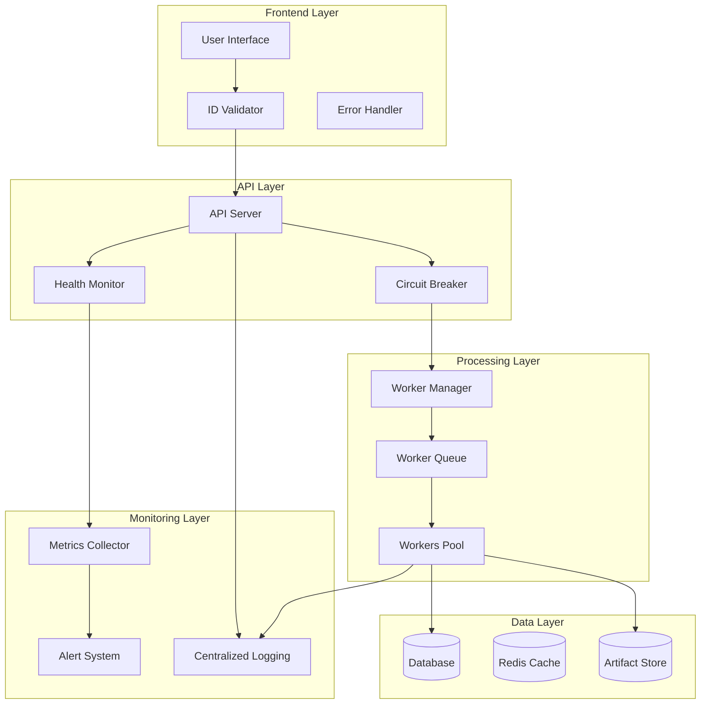

# System Stability Improvements - Design Document

## Overview

This design addresses critical system stability issues through a multi-layered approach focusing on frontend validation, worker optimization, artifact consistency, health monitoring, data recovery, performance optimization, and enhanced error handling. The solution implements defensive programming practices, automated recovery mechanisms, and comprehensive monitoring to ensure system reliability.

## Architecture

### High-Level Architecture



## Components and Interfaces

### 1. Frontend ID Validation System

**Component:** `ContractIdValidator`
- **Purpose:** Validate and sanitize contract IDs before API calls
- **Location:** `apps/web/lib/contract-id-validator.ts`

```typescript
interface ContractIdValidator {
  validateId(id: string): ValidationResult;
  generateValidId(): string;
  sanitizeId(id: string): string;
  isValidHexadecimal(id: string): boolean;
}

interface ValidationResult {
  isValid: boolean;
  error?: string;
  sanitized?: string;
}
```

**Component:** `ContractIdManager`
- **Purpose:** Centralized contract ID management across the frontend
- **Location:** `apps/web/lib/contract-id-manager.ts`

### 2. Worker Processing Optimization

**Component:** `EnhancedWorkerManager`
- **Purpose:** Optimize worker processing with monitoring and recovery
- **Location:** `apps/workers/shared/enhanced-worker-manager.ts`

```typescript
interface WorkerManager {
  processContract(contractId: string): Promise<ProcessingResult>;
  monitorProgress(contractId: string): Observable<ProgressUpdate>;
  retryFailedWorkers(contractId: string): Promise<void>;
  getWorkerHealth(): WorkerHealthStatus;
}

interface ProcessingResult {
  success: boolean;
  artifacts: ArtifactType[];
  errors: ProcessingError[];
  duration: number;
}
```

**Component:** `WorkerResourceMonitor`
- **Purpose:** Monitor and manage worker resource usage
- **Location:** `apps/workers/shared/resource-monitor.ts`

### 3. Artifact Generation System

**Component:** `ArtifactCompletionValidator`
- **Purpose:** Ensure all required artifacts are generated
- **Location:** `apps/api/src/services/artifact-completion-validator.service.ts`

```typescript
interface ArtifactValidator {
  validateCompleteness(contractId: string): Promise<ValidationReport>;
  generateMissingArtifacts(contractId: string): Promise<void>;
  createFallbackArtifacts(contractId: string, failedTypes: ArtifactType[]): Promise<void>;
}

interface ValidationReport {
  isComplete: boolean;
  missingTypes: ArtifactType[];
  corruptedArtifacts: string[];
  recommendations: string[];
}
```

### 4. System Health Monitoring

**Component:** `SystemHealthDashboard`
- **Purpose:** Comprehensive system health monitoring and alerting
- **Location:** `apps/api/src/services/system-health-dashboard.service.ts`

```typescript
interface HealthMonitor {
  getSystemHealth(): Promise<SystemHealthReport>;
  monitorMetrics(): Observable<MetricUpdate>;
  triggerAlert(alert: AlertDefinition): Promise<void>;
  performHealthCheck(): Promise<HealthCheckResult>;
}

interface SystemHealthReport {
  overall: HealthStatus;
  components: ComponentHealth[];
  metrics: SystemMetrics;
  alerts: ActiveAlert[];
}
```

### 5. Data Consistency and Recovery

**Component:** `DataConsistencyManager`
- **Purpose:** Ensure data integrity and implement recovery mechanisms
- **Location:** `packages/clients/db/src/services/data-consistency-manager.service.ts`

```typescript
interface ConsistencyManager {
  validateDataIntegrity(): Promise<IntegrityReport>;
  repairInconsistencies(issues: DataIssue[]): Promise<RepairResult>;
  performRecoveryOperation(operation: RecoveryOperation): Promise<void>;
}
```

## Data Models

### Enhanced Contract Model

```typescript
interface EnhancedContract {
  id: string; // Validated hexadecimal ID
  status: ContractStatus;
  processingMetadata: {
    startTime: Date;
    endTime?: Date;
    workerAttempts: WorkerAttempt[];
    artifactStatus: ArtifactStatus[];
  };
  healthMetrics: {
    lastHealthCheck: Date;
    consistencyScore: number;
    performanceMetrics: PerformanceMetric[];
  };
}
```

### System Health Model

```typescript
interface SystemHealth {
  timestamp: Date;
  components: {
    api: ComponentHealth;
    workers: ComponentHealth;
    database: ComponentHealth;
    cache: ComponentHealth;
  };
  metrics: {
    responseTime: number;
    throughput: number;
    errorRate: number;
    resourceUsage: ResourceUsage;
  };
  alerts: Alert[];
}
```

## Error Handling

### Error Classification System

1. **Critical Errors:** System-wide failures requiring immediate attention
2. **Processing Errors:** Worker or artifact generation failures with retry logic
3. **Validation Errors:** Data validation failures with user feedback
4. **Performance Errors:** Resource or performance threshold violations

### Error Recovery Strategies

```typescript
interface ErrorRecoveryStrategy {
  canHandle(error: SystemError): boolean;
  recover(error: SystemError): Promise<RecoveryResult>;
  escalate(error: SystemError): Promise<void>;
}
```

### Frontend Error Handling

- **Graceful Degradation:** Show cached data when API is unavailable
- **User Feedback:** Clear error messages with actionable steps
- **Automatic Retry:** Exponential backoff for transient failures
- **Fallback UI:** Alternative interfaces when primary features fail

## Testing Strategy

### 1. Unit Testing
- Contract ID validation functions
- Worker processing logic
- Artifact generation components
- Health monitoring utilities

### 2. Integration Testing
- End-to-end contract processing flow
- API error handling scenarios
- Database consistency operations
- Worker coordination and recovery

### 3. Performance Testing
- Load testing with concurrent users
- Memory usage under stress
- Database query optimization
- Worker processing throughput

### 4. Chaos Engineering
- Simulated component failures
- Network partition scenarios
- Resource exhaustion testing
- Recovery mechanism validation

### 5. Monitoring and Observability Testing
- Alert system functionality
- Metrics collection accuracy
- Log aggregation and analysis
- Dashboard responsiveness

## Implementation Phases

### Phase 1: Critical Fixes (Immediate)
1. Fix frontend contract ID validation
2. Implement basic error handling improvements
3. Add artifact completion validation
4. Deploy health monitoring basics

### Phase 2: Performance Optimization (Week 1)
1. Optimize worker processing
2. Implement resource monitoring
3. Add database performance improvements
4. Deploy caching strategies

### Phase 3: Advanced Monitoring (Week 2)
1. Complete health dashboard
2. Implement alerting system
3. Add data consistency checks
4. Deploy recovery mechanisms

### Phase 4: Resilience Features (Week 3)
1. Advanced error recovery
2. Chaos engineering implementation
3. Performance optimization
4. Complete testing suite

## Security Considerations

- **Input Validation:** All contract IDs validated before processing
- **Error Information:** Sanitized error messages to prevent information leakage
- **Resource Limits:** Prevent resource exhaustion attacks
- **Access Control:** Proper authentication for health monitoring endpoints

## Monitoring and Metrics

### Key Performance Indicators (KPIs)
- System uptime (target: 99.9%)
- Average response time (target: <200ms)
- Worker processing success rate (target: >95%)
- Artifact generation completeness (target: 100%)

### Alerting Thresholds
- API response time > 2 seconds
- Worker failure rate > 5%
- Database connection pool > 80% utilization
- Memory usage > 85%

### Dashboard Components
- Real-time system health overview
- Worker processing status
- Error rate trends
- Performance metrics visualization