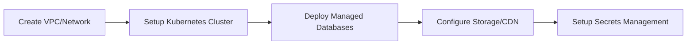
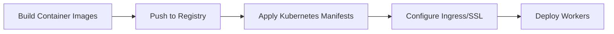
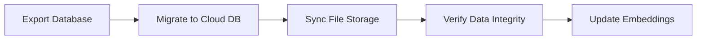

# Contract Intelligence Platform - Cloud Migration Architecture Guide

> **Comprehensive Architecture, Features, and Cloud Migration Readiness Assessment**

---

## Table of Contents

1. [Executive Summary](#1-executive-summary)
2. [System Architecture](#2-system-architecture)
3. [Core Features](#3-core-features)
4. [Technology Stack](#4-technology-stack)
5. [Cloud Migration Readiness Assessment](#5-cloud-migration-readiness-assessment)
6. [Cloud Platform Recommendations](#6-cloud-platform-recommendations)
7. [Migration Strategy](#7-migration-strategy)
8. [Security & Compliance](#8-security--compliance)
9. [Scalability & Performance](#9-scalability--performance)
10. [Cost Estimation](#10-cost-estimation)
11. [Migration Checklist](#11-migration-checklist)

---

## 1. Executive Summary

The **Contract Intelligence Platform** is an enterprise-grade contract management and AI-powered analysis platform built with modern cloud-native principles. The application is **highly ready for cloud migration** with:

| Readiness Category | Score | Status |
|-------------------|-------|--------|
| **Containerization** | ✅ 95% | Docker-ready with multi-stage builds |
| **Orchestration** | ✅ 90% | Full Kubernetes manifests available |
| **Stateless Architecture** | ✅ 85% | External state management (Redis, PostgreSQL) |
| **12-Factor Compliance** | ✅ 90% | Environment-based configuration |
| **Horizontal Scaling** | ✅ 85% | HPA, worker scaling configured |
| **Security** | ✅ 90% | RBAC, network policies, encryption |
| **Observability** | ✅ 80% | Health checks, logging, metrics |
| **Data Portability** | ✅ 85% | S3-compatible storage, standard databases |

**Overall Cloud Readiness: 87%** - Ready for production cloud deployment

---

## 2. System Architecture

### High-Level Architecture Overview

```
┌─────────────────────────────────────────────────────────────────────────────┐
│                              LOAD BALANCER                                   │
│                     (Nginx / Cloud LB / CDN)                                │
│                          Port 80/443                                         │
└─────────────────────────────────────────────────────────────────────────────┘
                                    │
        ┌───────────────────────────┼───────────────────────────┐
        ▼                           ▼                           ▼
┌─────────────────┐     ┌─────────────────────┐     ┌─────────────────┐
│   Web (Next.js) │     │    WebSocket        │     │   API Service   │
│   Port 3000     │     │   Port 3001         │     │   Port 8080     │
│   (3 replicas)  │     │   (2 replicas)      │     │   (optional)    │
└────────┬────────┘     └──────────┬──────────┘     └────────┬────────┘
         │                         │                         │
         └─────────────────────────┼─────────────────────────┘
                                   │
        ┌──────────────────────────┼──────────────────────────┐
        ▼                          ▼                          ▼
┌─────────────────┐     ┌─────────────────┐     ┌─────────────────┐
│   PostgreSQL    │     │     Redis       │     │     MinIO       │
│   + pgvector    │     │  (Cache/Queue)  │     │   (S3 Storage)  │
│   Port 5432     │     │   Port 6379     │     │   Port 9000     │
└─────────────────┘     └─────────────────┘     └─────────────────┘
         │
         │
┌─────────────────┐     ┌─────────────────┐
│   Workers       │     │   ChromaDB      │
│  (BullMQ Jobs)  │     │  (Vector DB)    │
│  (3 replicas)   │     │   Port 8000     │
└─────────────────┘     └─────────────────┘
```

### Container Architecture

| Container | Purpose | Replicas | Memory | CPU |
|-----------|---------|----------|--------|-----|
| **web** | Next.js frontend + API routes | 2-10 (auto-scaled) | 4Gi | 1000m |
| **websocket** | Real-time WebSocket server | 2 | 1Gi | 500m |
| **workers** | Background job processing | 2-8 (auto-scaled) | 4Gi | 1000m |
| **postgres** | Primary database with vectors | 1 | 2Gi | 1000m |
| **redis** | Job queues, caching, pub/sub | 1 | 1.5Gi | 500m |
| **minio** | S3-compatible file storage | 1 | 1Gi | 500m |
| **chromadb** | Vector database for RAG | 1 | 2Gi | 500m |

### Multi-Tenancy Strategy

The platform uses **database-level multi-tenancy** with row-level isolation:

- ✅ Every table has `tenantId` column
- ✅ Middleware automatically adds tenant filter to all queries
- ✅ JWT tokens contain tenant context
- ✅ Storage isolation via MinIO buckets/prefixes per tenant
- ✅ Redis namespacing includes tenant prefix

---

## 3. Core Features

### 3.1 Contract Management

| Feature | Description | Cloud-Ready |
|---------|-------------|-------------|
| **Document Upload** | PDF, DOCX, XLSX, Images (100MB max) | ✅ S3-compatible |
| **OCR Processing** | Mistral OCR, GPT-4 Vision, Tesseract | ✅ Stateless |
| **Bulk Operations** | Mass upload and batch processing | ✅ Queue-based |
| **Version Control** | Contract versions and amendments | ✅ Database-backed |
| **Contract Hierarchy** | MSA → SOW → Amendments | ✅ Relational |

### 3.2 AI-Powered Analysis

| Feature | Description | AI Provider |
|---------|-------------|-------------|
| **Artifact Generation** | Auto-extract key information | OpenAI GPT-4 |
| **Overview & Summary** | Executive summaries | GPT-4 |
| **Clause Analysis** | Liability, SLA, termination clauses | GPT-4 |
| **Financial Terms** | Payment terms, rate tables | GPT-4 |
| **Risk Assessment** | Risk factors, compliance issues | GPT-4 |
| **Compliance Check** | Regulatory compliance analysis | GPT-4 |

### 3.3 Rate Card Intelligence

- Rate card management and import
- Market benchmarking comparisons
- AI-powered role standardization
- Geographic rate analysis
- Supplier scoring and ranking
- Savings opportunity identification
- Predictive rate analytics

### 3.4 RAG (Retrieval-Augmented Generation)

- **Vector Search**: Semantic search using pgvector/ChromaDB
- **Knowledge Graph**: Entity relationships and networks
- **Multi-Modal**: Tables, images, mixed content
- **Cross-Contract Intelligence**: Pattern detection
- **Natural Language Queries**: Plain English questions

### 3.5 Workflow & Collaboration

- Configurable approval workflows
- Team comments with @mentions
- Real-time WebSocket notifications
- Activity feed and audit logging
- Document sharing with permissions

### 3.6 Integrations

| Integration | Status | Type |
|-------------|--------|------|
| Google Drive | ✅ Ready | OAuth 2.0 |
| SharePoint | 🔧 Planned | Microsoft Graph |
| Dropbox | 🔧 Planned | OAuth 2.0 |
| DocuSign | 🔧 Planned | REST API |
| SAP/Coupa | 🔧 Planned | ERP Connector |
| Webhooks | ✅ Ready | Event-driven |

---

## 4. Technology Stack

### Frontend

| Technology | Version | Purpose |
|------------|---------|---------|
| Next.js | 15 | React framework (App Router) |
| React | 19 | UI library |
| TypeScript | 5.x | Type safety |
| Tailwind CSS | 3.x | Styling |
| Radix UI | Latest | Accessible components |

### Backend

| Technology | Version | Purpose |
|------------|---------|---------|
| Node.js | 22+ | Runtime (--max-old-space-size=4096) |
| Fastify | Latest | API server (optional) |
| Prisma | Latest | ORM with PostgreSQL |
| BullMQ | Latest | Job queue processing |

### Databases & Storage

| Technology | Purpose | Cloud Equivalent |
|------------|---------|------------------|
| PostgreSQL 16 + pgvector | Primary DB + vectors | AWS RDS, GCP Cloud SQL, Azure DB |
| Redis 7 | Cache, queues, pub/sub | AWS ElastiCache, GCP Memorystore |
| MinIO | S3-compatible storage | AWS S3, GCP Cloud Storage, Azure Blob |
| ChromaDB | Vector embeddings | Pinecone, Weaviate, or self-hosted |

### AI Services

| Service | Purpose | Alternative |
|---------|---------|-------------|
| OpenAI GPT-4 | Analysis, extraction | Azure OpenAI |
| Mistral AI | OCR, fast inference | Self-hosted |
| AWS Textract | Document OCR | Google Document AI |

---

## 5. Cloud Migration Readiness Assessment

### ✅ What's Already Cloud-Ready

#### Containerization (95%)

```yaml
# Production Dockerfiles available:
- Dockerfile              # Multi-stage Next.js build
- Dockerfile.workers      # Background workers
- Dockerfile.websocket    # WebSocket server
- Dockerfile.staging      # Staging environment
```

#### Kubernetes Deployment (90%)

```yaml
# kubernetes/deployment.yaml includes:
- Namespace configuration
- StatefulSets (PostgreSQL)
- Deployments (App, WebSocket, Workers)
- Services and Ingress
- HorizontalPodAutoscaler
- PodDisruptionBudget
- ConfigMaps and Secrets
```

#### Security Policies (90%)

```yaml
# kubernetes/security-policies.yaml includes:
- Pod Security Standards (Restricted)
- RBAC with minimal permissions
- NetworkPolicies (default deny)
- Service mesh ready
```

#### Docker Compose Variants

| File | Purpose |
|------|---------|
| `docker-compose.dev.yml` | Local development |
| `docker-compose.prod.yml` | Production deployment |
| `docker-compose.staging.yml` | Staging environment |
| `docker-compose.full.yml` | Full stack with all services |
| `docker-compose.pgbouncer.yml` | Connection pooling |
| `docker-compose.rag.yml` | RAG-specific services |

### 🔧 Improvements Needed

| Area | Current State | Recommended Improvement |
|------|---------------|------------------------|
| **Secrets Management** | Environment variables | AWS Secrets Manager / HashiCorp Vault |
| **Logging** | Console logs | CloudWatch / Stackdriver structured logging |
| **Metrics** | Basic health checks | Prometheus + Grafana / Cloud Monitoring |
| **Tracing** | Not implemented | OpenTelemetry / X-Ray |
| **CDN** | Not configured | CloudFront / CloudFlare for static assets |
| **Backup** | Manual scripts | Automated cloud backups |

---

## 6. Cloud Platform Recommendations

### Option A: AWS (Recommended)

```
┌─────────────────────────────────────────────────────────────────────────┐
│                           AWS Architecture                               │
├─────────────────────────────────────────────────────────────────────────┤
│                                                                          │
│  ┌─────────────┐    ┌─────────────┐    ┌─────────────┐                 │
│  │ CloudFront  │───▶│     ALB     │───▶│    EKS      │                 │
│  │   (CDN)     │    │   (HTTPS)   │    │ (Kubernetes)│                 │
│  └─────────────┘    └─────────────┘    └─────────────┘                 │
│                                              │                          │
│         ┌────────────────────────────────────┼────────────────┐        │
│         ▼                    ▼               ▼                ▼        │
│  ┌─────────────┐    ┌─────────────┐   ┌───────────┐   ┌───────────┐   │
│  │ RDS Aurora  │    │ ElastiCache │   │    S3     │   │ Textract  │   │
│  │ PostgreSQL  │    │   (Redis)   │   │ (Storage) │   │   (OCR)   │   │
│  │ + pgvector  │    │             │   │           │   │           │   │
│  └─────────────┘    └─────────────┘   └───────────┘   └───────────┘   │
│                                                                          │
│  ┌─────────────┐    ┌─────────────┐   ┌───────────────────────────┐    │
│  │  Secrets    │    │ CloudWatch  │   │      OpenSearch           │    │
│  │  Manager    │    │  (Logging)  │   │  (Vector Search - alt)    │    │
│  └─────────────┘    └─────────────┘   └───────────────────────────┘    │
│                                                                          │
└─────────────────────────────────────────────────────────────────────────┘
```

**AWS Service Mapping:**
| Component | AWS Service | Tier |
|-----------|-------------|------|
| Kubernetes | EKS | Managed |
| PostgreSQL | RDS Aurora PostgreSQL | db.r6g.large |
| Redis | ElastiCache | cache.r6g.large |
| Storage | S3 Standard | Pay-per-use |
| Secrets | Secrets Manager | Standard |
| Logging | CloudWatch Logs | Standard |
| OCR | Textract | Pay-per-page |
| AI | OpenAI API or Bedrock | Pay-per-token |

### Option B: Google Cloud Platform

| Component | GCP Service |
|-----------|-------------|
| Kubernetes | GKE Autopilot |
| PostgreSQL | Cloud SQL + pgvector |
| Redis | Memorystore |
| Storage | Cloud Storage |
| Secrets | Secret Manager |
| AI | Vertex AI |

### Option C: Azure

| Component | Azure Service |
|-----------|---------------|
| Kubernetes | AKS |
| PostgreSQL | Azure Database for PostgreSQL |
| Redis | Azure Cache for Redis |
| Storage | Azure Blob Storage |
| Secrets | Key Vault |
| AI | Azure OpenAI Service |

---

## 7. Migration Strategy

### Phase 1: Infrastructure Setup (Week 1-2)



**Tasks:**

- [ ] Create VPC with public/private subnets
- [ ] Deploy Kubernetes cluster (EKS/GKE/AKS)
- [ ] Provision managed PostgreSQL with pgvector
- [ ] Provision managed Redis cluster
- [ ] Create S3 bucket for document storage
- [ ] Configure CloudFront CDN
- [ ] Setup Secrets Manager
- [ ] Configure IAM roles and policies

### Phase 2: Application Deployment (Week 2-3)



**Tasks:**

- [ ] Build and push Docker images to ECR/GCR/ACR
- [ ] Apply ConfigMaps and Secrets
- [ ] Deploy application pods
- [ ] Configure Ingress with SSL/TLS
- [ ] Deploy background workers
- [ ] Configure HPA autoscaling

### Phase 3: Data Migration (Week 3-4)



**Tasks:**

- [ ] Export PostgreSQL data with pg_dump
- [ ] Restore to managed database
- [ ] Sync MinIO → S3 with rclone/aws-cli
- [ ] Verify all contracts accessible
- [ ] Re-index vector embeddings if needed

### Phase 4: Testing & Cutover (Week 4-5)

**Tasks:**

- [ ] Run E2E test suite against cloud environment
- [ ] Performance testing under load
- [ ] Security scan and penetration testing
- [ ] DNS cutover planning
- [ ] Rollback procedure documentation
- [ ] Production cutover

---

## 8. Security & Compliance

### Data Protection

| Requirement | Implementation | Status |
|-------------|----------------|--------|
| Encryption at Rest | AES-256 (S3, RDS) | ✅ Ready |
| Encryption in Transit | TLS 1.3 | ✅ Ready |
| Key Management | AWS KMS / Cloud KMS | 🔧 Configure |
| Data Classification | tenantId isolation | ✅ Implemented |

### Access Control

| Control | Implementation |
|---------|----------------|
| Authentication | NextAuth.js with JWT |
| Authorization | Role-based (RBAC) |
| API Security | Rate limiting, API keys |
| Network | VPC, Security Groups, NetworkPolicy |

### Compliance Readiness

| Standard | Status | Notes |
|----------|--------|-------|
| **GDPR** | ✅ Ready | Data export, deletion APIs |
| **Swiss FADP** | ✅ Ready | Swiss data residency option |
| **SOC 2** | 🔧 Partial | Audit logging implemented |
| **ISO 27001** | 🔧 Partial | Security controls in place |
| **HIPAA** | 🔧 Partial | Encryption, access logs |

### Network Security (Kubernetes)

```yaml
# NetworkPolicy: Default deny all
apiVersion: networking.k8s.io/v1
kind: NetworkPolicy
metadata:
  name: default-deny-all
spec:
  podSelector: {}
  policyTypes: [Ingress, Egress]

# Allow only necessary traffic
# - App ← Ingress
# - App → PostgreSQL, Redis, MinIO
# - Workers → External AI APIs
```

---

## 9. Scalability & Performance

### Auto-Scaling Configuration

```yaml
# HorizontalPodAutoscaler
apiVersion: autoscaling/v2
kind: HorizontalPodAutoscaler
spec:
  minReplicas: 2
  maxReplicas: 10
  metrics:
    - type: Resource
      resource:
        name: cpu
        target:
          averageUtilization: 70
    - type: Resource
      resource:
        name: memory
        target:
          averageUtilization: 80
```

### Performance Targets

| Metric | Target | Strategy |
|--------|--------|----------|
| API Response (p95) | < 200ms | Redis caching |
| Database Query (p95) | < 50ms | Indexes, PgBouncer |
| Cache Hit Rate | > 80% | TTL optimization |
| Concurrent Users | 1,000+ | Horizontal scaling |
| Contracts/Tenant | 100,000+ | Database partitioning |
| File Upload | 100MB max | Chunked uploads, S3 |

### Caching Strategy

```typescript
// Multi-level caching
const cacheConfig = {
  dashboard: { ttl: 300 },      // 5 minutes
  contractList: { ttl: 60 },    // 1 minute
  contractDetail: { ttl: 300 }, // 5 minutes
  artifacts: { ttl: 3600 },     // 1 hour (rarely changes)
  analytics: { ttl: 600 },      // 10 minutes
};
```

### Connection Pooling (PgBouncer)

```ini
# PgBouncer configuration
pool_mode = transaction
max_client_conn = 1000
default_pool_size = 50
reserve_pool_size = 25
```

---

## 10. Cost Estimation

### AWS Monthly Cost Estimate (Production)

| Service | Configuration | Est. Monthly Cost |
|---------|---------------|-------------------|
| **EKS Cluster** | 1 cluster | $73 |
| **EC2 (Nodes)** | 3x m6i.large | $210 |
| **RDS Aurora** | db.r6g.large, 100GB | $250 |
| **ElastiCache** | cache.r6g.large | $180 |
| **S3** | 500GB + requests | $50 |
| **CloudFront** | 1TB transfer | $85 |
| **ALB** | 1 load balancer | $25 |
| **Secrets Manager** | 10 secrets | $5 |
| **CloudWatch** | Logs + Metrics | $50 |
| **OpenAI API** | ~1M tokens/day | $600 |
| **Data Transfer** | 500GB/month | $45 |

**Estimated Total: ~$1,573/month** (production workload)

### Cost Optimization Tips

1. **Reserved Instances**: Save 30-50% on EC2/RDS
2. **Spot Instances**: Use for workers (60-70% savings)
3. **S3 Lifecycle**: Move old files to Glacier
4. **Right-sizing**: Monitor and adjust instance sizes
5. **Caching**: Reduce database and API calls

---

## 11. Migration Checklist

### Pre-Migration

- [ ] Complete cloud architecture design
- [ ] Set up cloud accounts and billing
- [ ] Configure VPC and networking
- [ ] Create Kubernetes cluster
- [ ] Provision managed databases
- [ ] Set up container registry
- [ ] Configure CI/CD pipeline
- [ ] Create staging environment

### Migration Execution

- [ ] Build and push Docker images
- [ ] Deploy Kubernetes resources
- [ ] Configure secrets and ConfigMaps
- [ ] Set up Ingress with SSL
- [ ] Migrate PostgreSQL data
- [ ] Sync file storage to S3
- [ ] Configure DNS records
- [ ] Deploy monitoring stack

### Post-Migration

- [ ] Run E2E test suite
- [ ] Performance testing
- [ ] Security assessment
- [ ] Update documentation
- [ ] Train operations team
- [ ] Configure alerting
- [ ] Set up backup/restore procedures
- [ ] Document runbooks

### Go-Live Checklist

- [ ] DNS cutover plan approved
- [ ] Rollback procedure tested
- [ ] On-call team briefed
- [ ] Customer communication sent
- [ ] Monitoring dashboards ready
- [ ] Perform DNS switch
- [ ] Verify all services operational
- [ ] Decommission old infrastructure

---

## Quick Start Commands

### Local Development

```bash
# Start infrastructure
docker compose -f docker-compose.dev.yml up -d

# Start application
pnpm dev

# Run workers
pnpm workers
```

### Build for Production

```bash
# Build Docker images
docker build -t contract-intel-app:latest -f Dockerfile .
docker build -t contract-intel-workers:latest -f Dockerfile.workers .
docker build -t contract-intel-websocket:latest -f Dockerfile.websocket .

# Push to registry
docker tag contract-intel-app:latest ghcr.io/yourorg/contract-intel-app:latest
docker push ghcr.io/yourorg/contract-intel-app:latest
```

### Deploy to Kubernetes

```bash
# Apply manifests
kubectl apply -f kubernetes/deployment.yaml
kubectl apply -f kubernetes/security-policies.yaml

# Check status
kubectl get pods -n contract-intel
kubectl logs -f deployment/app -n contract-intel
```

---

## Summary

The Contract Intelligence Platform is **well-architected for cloud migration** with:

- ✅ **Containerized** - Production-ready Docker images
- ✅ **Orchestration** - Full Kubernetes manifests
- ✅ **Stateless** - External state in PostgreSQL/Redis/S3
- ✅ **Scalable** - HPA, worker pools, connection pooling
- ✅ **Secure** - RBAC, encryption, network policies
- ✅ **Observable** - Health checks, structured logging
- ✅ **Multi-Tenant** - Database-level isolation

**Recommended Next Steps:**

1. Choose cloud provider (AWS recommended)
2. Set up staging environment
3. Run migration rehearsal
4. Execute production migration
5. Monitor and optimize

---

*Document Version: 1.0.0*  
*Last Updated: December 20, 2025*
