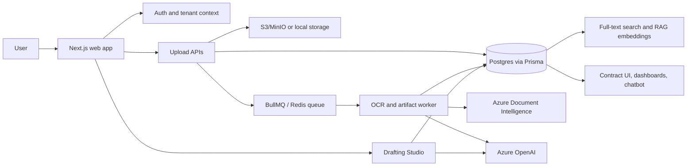
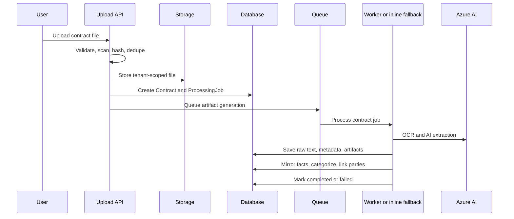
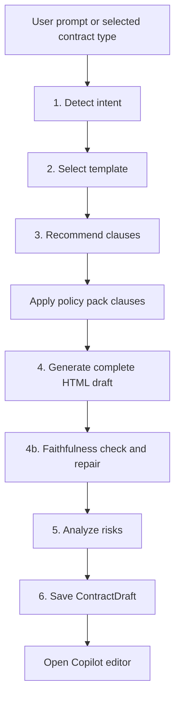

# Contigo Contract System and Drafting Studio Slide Brief

Use this as source material for a product or architecture slide deck. It explains how Contigo turns uploaded contracts into searchable, structured contract intelligence, and how the Drafting Studio creates, edits, reviews, and finalizes new contracts.

## Executive Story

Contigo is a contract intelligence platform. A user uploads an existing contract, and the system validates the file, stores it by tenant, extracts text with OCR, generates structured AI artifacts, mirrors key facts back onto the contract record, categorizes the contract, links parties, indexes it for search/RAG, and exposes the result in contract views, dashboards, and the AI chatbot.

The Drafting Studio is the creation side of the same platform. A user can start from a prompt, template, contract type, renewal/amendment workflow, or blank canvas. The agentic drafting pipeline detects intent, selects a template, applies clauses and policy packs, generates a complete HTML draft, checks that the user's requested terms appear in the contract, analyzes risk, and saves a `ContractDraft`. The Copilot editor then supports live editing, AI clause work, comments, versions, approvals, exports, and finalization into a `Contract` record.

## Suggested Slide Deck

### Slide 1: What Contigo Does

Slide copy:

- Contigo turns contract documents into structured intelligence and assisted drafting workflows.
- Existing contracts become searchable records with extracted metadata, risks, obligations, renewals, parties, and financial terms.
- New contracts are drafted in a guided studio with AI generation, policy packs, risk review, collaboration, and finalization.

Speaker notes:

- The platform has two linked halves: contract intelligence for uploaded agreements, and drafting automation for creating new agreements.
- Both halves share tenant isolation, AI services, Prisma/Postgres, and the same contract data model.

### Slide 2: Platform Architecture at a Glance

Speaker notes:

- The web app owns the user experience and API routes.
- Background processing can run through BullMQ workers; if queue processing is unavailable, upload processing has an inline fallback.
- Azure Document Intelligence handles OCR/layout extraction; Azure OpenAI handles metadata extraction, artifact generation, chat, and drafting.

### Slide 3: Core Data Model

Slide copy:

- `Contract`: one uploaded or finalized contract, scoped by `tenantId`.
- `ProcessingJob`: progress, queue ID, current step, retries, and errors for processing.
- `Artifact`: AI-generated JSON analysis for each artifact type.
- `ContractEmbedding`: chunked vector rows for RAG and semantic retrieval.
- `ContractDraft`: editable drafting workspace before it becomes a contract.
- `DraftComment` and `DraftVersion`: collaboration and version history for drafts.

Speaker notes:

- The `Contract` row is the operational surface the UI reads most often.
- Rich analysis lives in `Artifact.data` as JSON, but important values are also mirrored to scalar `Contract` columns so list/detail pages can load quickly.
- `ContractArtifact` is a separate key-value model and should not be confused with `Artifact`, which stores the 14 generated JSON blobs.

## Contract Upload and Processing

### Slide 4: Upload Entry Points

Slide copy:

- Direct upload: `POST /api/contracts/upload` for normal multipart uploads.
- Chunked upload: `init`, `chunk`, and `finalize` routes for large or resumable uploads.
- Batch upload route exists for multi-file flows.
- Every upload runs under authenticated tenant context.

Speaker notes:

- The upload route never trusts `tenantId` from the form body. Tenant scope comes from the authenticated API context.
- Storage keys are tenant-scoped, for example `contracts/{tenantId}/{storedFileName}`.
- Upload also creates a `ProcessingJob`, publishes realtime creation events, and triggers artifact generation.

### Slide 5: Upload Security and Validation

Slide copy:

- Rate limits: upload requests are rate-limited by tenant, with Redis and in-memory fallback.
- Quotas: tenant contract count and storage usage are checked before accepting a file.
- File checks: extension allowlist, MIME allowlist, size limit, magic-byte validation.
- Security scan: file buffers are scanned before storage and processing.
- Duplicate detection: recent uploads are detected by SHA-256 checksum.
- Safe names: filenames are sanitized and stored with timestamp plus random suffix.

Speaker notes:

- Direct upload supports PDF, DOC/DOCX, text, and common image formats.
- Direct uploads have a 100 MB max file size in the current implementation.
- Duplicate detection checks the same tenant for matching checksum within a recent window and can return the existing contract instead of creating another record.

### Slide 6: Upload to Intelligence Pipeline

Speaker notes:

- The upload API responds after the contract and job are created and processing has been queued.
- Processing updates `ProcessingJob.currentStep` and `progress`, so the UI can show progress.
- If the queue is unavailable or no worker picks up a job in development, inline fallback can call `generateRealArtifacts()` directly.

### Slide 7: OCR and Text Extraction

Slide copy:

- The processor locates the stored file from local fallback paths or object storage.
- Text extraction prefers cloud OCR/layout extraction for PDFs and scanned documents.
- DOCX files are also converted to HTML for editor/redline use when possible.
- Extracted text is cleaned before AI analysis: whitespace normalization, page-number removal, table preservation.
- `rawText` and `searchableText` are persisted early so search/RAG consumers can use the contract even before all artifacts finish.

Speaker notes:

- The text extraction stage is the foundation for everything else: metadata, artifact generation, search, chatbot answers, and embeddings.
- OCR provenance is tracked with fields such as `ocrProvider`, `ocrModel`, and `ocrProcessedAt`.
- Low OCR confidence is carried into artifact validation so users can review uncertain outputs.

### Slide 8: Pre-Artifact Metadata Extraction

Slide copy:

- Metadata is extracted before artifact generation so later prompts can use grounded facts.
- Key fields include title, contract type, start/end dates, value, currency, parties, client, supplier, and signature status.
- Dates are mirrored across legacy and modern columns, for example `startDate` and `effectiveDate`.
- Signature detection sets `signatureStatus` and `signatureRequiredFlag`.
- Tiered document-type classification records confidence and classification metadata.

Speaker notes:

- This pre-artifact step makes downstream artifacts more accurate because the artifact prompts can reference the best-known contract facts.
- It also improves the UI quickly because important scalar fields are written before the full artifact loop finishes.

### Slide 9: The 14 Generated Artifacts

Slide copy:

- `OVERVIEW`: summary, key points, parties, dates, type.
- `CLAUSES`: major clauses and their importance.
- `FINANCIAL`: values, currency, payment terms, billing frequency.
- `RISK`: risk level, issues, mitigations.
- `COMPLIANCE`: standards, requirements, governing law, jurisdiction.
- `OBLIGATIONS`: party obligations and deadlines.
- `RENEWAL`: renewal terms, notice periods, termination, expiration.
- `NEGOTIATION_POINTS`: priority areas and suggested changes.
- `AMENDMENTS`: modification history and impacts.
- `CONTACTS`: contact and notice information.
- `PARTIES`: party roles, relationships, signatories.
- `TIMELINE`: effective date, end date, milestones, duration.
- `DELIVERABLES`: deliverables, deadlines, acceptance criteria.
- `EXECUTIVE_SUMMARY`: executive-level takeaways, recommendations, value proposition.

Speaker notes:

- Artifacts are stored as JSON in the `Artifact` table and keyed by `(contractId, type)`.
- The generator runs artifacts in parallel batches, retries transient Azure OpenAI rate-limit/server errors, validates required fields, and flags `needs_review` when quality or OCR confidence is weak.
- Partial failures are recorded in `Contract.metadata` as `partialFailure`, `failedArtifactTypes`, expected count, and generated count.

### Slide 10: Metadata Mirroring and Enrichment

Slide copy:

- Artifact JSON is rich, but list/detail screens need fast scalar fields.
- After artifacts finish, selected artifact data is mirrored into `Contract` columns only when those columns are empty.
- Examples: payment terms, billing cycle, jurisdiction, renewal terms, notice period, termination clause, auto-renewal, description, keywords, total value, expiration date, days until expiry.
- Parties are linked from the `PARTIES` artifact to `Contract.clientId` and `Contract.supplierId`.
- Tenant taxonomy is seeded if needed, then the contract is auto-categorized.

Speaker notes:

- Mirroring prevents the UI from showing "Not specified" while artifact pages already contain the answer.
- The mirror is conservative: it fills blanks but does not overwrite manual edits.
- Party linking uses global `Party` rows and maps free-text party roles into client/supplier-style relationships.

### Slide 11: Final Processing Outcomes

Slide copy:

- Success: contract status becomes `COMPLETED`, timestamps are updated, and reindexing is queued.
- Partial success: contract can still be completed, but metadata records which artifacts failed.
- Failure: contract and processing job become `FAILED`, with the error stored for troubleshooting.
- Completion triggers webhooks and durable integration events.
- RAG indexing creates embeddings for semantic search and chatbot grounding.

Speaker notes:

- `ProcessingJob` is the operational audit trail for background work.
- `Contract.metadata` holds product-facing processing details such as artifact counts and partial failure flags.
- The post-processing reindex feeds `ContractEmbedding` rows for hybrid search and RAG.

### Slide 12: How the Chatbot Uses Processed Contracts

Slide copy:

- Contract chat uses the contract ID as context.
- It gathers facts from RAG sources, artifact/metadata context, and raw contract text fallback.
- The chat stream returns metadata, answer content, citations, and completion events.
- Citations can deep-link users back to the contract evidence preview.

Speaker notes:

- The chatbot is only as good as the upload pipeline because it depends on OCR text, artifacts, embeddings, and metadata.
- If embeddings are missing, the system can still fall back to searchable/raw text context.

## Drafting Studio

### Slide 13: Drafting Studio Entry Points

Slide copy:

- Drafting landing page: browse recent drafts, templates, quick starts, and AI prompt entry.
- AI interview: conversational scoping that turns a rough prompt into an enriched drafting brief.
- Agentic draft dialog: runs the 6-step generation pipeline with live progress.
- Copilot editor route: `/drafting/copilot?draft={id}` for active editing.
- Renewal/amendment handoffs can carry source contract context into the editor.

Speaker notes:

- The drafting experience supports both fast creation and controlled review.
- Users can start broad with a prompt or precise with a template, playbook, source contract, or blank canvas.

### Slide 14: Conversational Draft Interview

Slide copy:

- The interview asks targeted follow-up questions one at a time.
- It extracts a running brief: contract type, role, counterparty, term, renewal, governing law, liability cap, payment terms, confidentiality, tone, special terms.
- Quick-answer chips speed up option-style questions.
- Users can draft early once enough fields are captured.
- The final output is an enriched prompt that tells the generator to use captured values verbatim.

Speaker notes:

- The interview is not just a form; it is a stateful chat that persists session progress for accidental closes.
- Users can edit captured brief fields before generation.

### Slide 15: Agentic Draft Generation Pipeline

Slide copy:

- Detects contract type, title, variables, and instructions.
- Selects the best tenant template or falls back to available templates.
- Pulls standard, mandatory, contract-type, and policy-pack clauses.
- Generates full HTML for the WYSIWYG editor.
- Checks that user-stated values made it into the draft.
- Saves a `ContractDraft` with clauses, variables, structure, risks, and status.

Speaker notes:

- The pipeline streams progress with server-sent events so the UI can show each step.
- If AI is not configured or a deployment is unavailable, template fallback paths keep the user from hitting a blank wall.

### Slide 16: Faithfulness Enforcement

Slide copy:

- The generator parses labelled values from the enriched prompt.
- It checks whether those values appear in the generated plain text.
- If anything is missing, it runs a focused repair pass.
- If anything is still missing, it appends a visible `Schedule A - User-Requested Terms` section.
- The UI receives a faithfulness report with honored/total counts and repair flags.

Speaker notes:

- This is a key product differentiator: the system does not only generate a contract; it verifies that the user's explicit instructions are physically present in the contract.
- The addendum is a safety net, clearly marked for reviewer integration.

### Slide 17: Copilot Drafting Canvas

Slide copy:

- TipTap-based WYSIWYG editor for contract HTML.
- Autosaves draft content and title after edits.
- Tracks unsaved state, save failures, finalized read-only mode, and title changes.
- Sidebar tabs: Assistant, Review, Clauses, Variables.
- Supports exports to PDF and DOCX.

Speaker notes:

- The visible document title is draft metadata, not part of the TipTap document body.
- Autosave writes to `PATCH /api/drafts/{id}` and creates throttled version snapshots.
- Finalized drafts are locked into a read-only editor state.

### Slide 18: In-Editor AI Assistance

Slide copy:

- The assistant can add, replace, remove, rewrite, fill variables, or tighten risky clauses.
- It sends selected text, current content, contract type, and playbook context to `draft-assistant`.
- Policy packs influence clause language and negotiation posture.
- AI responses return an operation, detected category, detected parameters, draft HTML, and apply mode.
- The editor can insert at cursor or replace selected text.

Speaker notes:

- This makes the assistant behave like an editor, not only a chatbot.
- The prompt explicitly tells the model to prefer drafting over asking, and to use concrete user/playbook values instead of generic placeholders.

### Slide 19: Shape Assist and Live Review

Slide copy:

- Shape Assist continuously scans the draft without calling the LLM.
- It detects placeholders, thin sections, and undefined capitalized terms.
- Each finding has a one-click AI handoff with local context.
- Risk chips from generated or realtime analysis appear in the editor and review panel.
- Reviewer comments can generate AI redline prompts.

Speaker notes:

- Deterministic scanning keeps the assistant responsive and cheap.
- The AI only runs when the user clicks a targeted CTA.
- Clicking a finding can focus the exact text range before sending the AI prompt.

### Slide 20: Collaboration, Governance, and Finalization

Slide copy:

- Draft statuses: `DRAFT`, `IN_REVIEW`, `PENDING_APPROVAL`, `APPROVED`, `REJECTED`, `FINALIZED`.
- Comments support anchored review discussions and team mentions.
- Versions capture snapshots for comparison and rollback-style review.
- Locks prevent conflicting edits by another user.
- Finalization creates a `Contract` record from the draft HTML.

Speaker notes:

- `POST /api/drafts/{id}/finalize` validates content/title, marks the draft finalized, and creates a `Contract` with `importSource: DRAFTING`.
- The finalized contract starts as status `DRAFT`, stores HTML content as `rawText`, is marked unsigned, and links back to the source draft.

## End-to-End Storyline for Slides

1. Upload: user drops in an existing agreement.
2. Validate: platform confirms tenant, file safety, quota, type, and duplicates.
3. Extract: OCR/layout produces clean text and tables.
4. Understand: AI extracts metadata and generates 14 artifacts.
5. Operationalize: facts are mirrored to contract fields, parties/taxonomy are linked, and search/RAG indexing starts.
6. Use: dashboards, contract detail pages, chatbot, renewals, obligations, and search use the enriched contract.
7. Draft: user creates a new agreement from prompt/template/source contract.
8. Govern: policy packs, clause libraries, faithfulness checks, risk review, comments, versions, and approvals control quality.
9. Finalize: approved draft becomes a contract record and enters the wider contract system.

## Important Implementation Details

### Upload and Processing Files

- `apps/web/app/api/contracts/upload/route.ts`: direct upload route wrapper.
- `apps/web/lib/contracts/server/upload-single.ts`: validation, storage, contract creation, queue trigger.
- `apps/web/lib/contracts/server/chunked-upload.ts`: upload session, chunk storage, final assembly.
- `apps/web/lib/artifact-trigger.ts`: BullMQ trigger plus inline fallback.
- `apps/web/lib/real-artifact-generator.ts`: OCR, metadata extraction, artifact generation, mirroring, categorization, final status.
- `packages/workers/src/ocr-artifact-worker.ts`: worker-side OCR/artifact processing path.
- `packages/clients/db/schema.prisma`: source of truth for `Contract`, `Artifact`, `ProcessingJob`, `ContractEmbedding`, and `ContractDraft`.

### Drafting Files

- `apps/web/app/drafting/page.tsx`: drafting landing page and draft cards.
- `apps/web/components/drafting/DraftInterviewChat.tsx`: conversational scoping and enriched prompt generation.
- `apps/web/components/drafting/AgenticDraftDialog.tsx`: modal that drives the 6-step draft pipeline.
- `apps/web/app/api/ai/agents/draft/route.ts`: agentic draft generation API.
- `apps/web/app/drafting/copilot/page.tsx`: editor route hydration and handoff logic.
- `apps/web/components/drafting/CopilotDraftingCanvas.tsx`: editor, sidebar, autosave, comments, versions, AI assist, export, finalization UI.
- `apps/web/app/api/ai/agents/draft-assistant/route.ts`: in-editor AI operations.
- `apps/web/components/drafting/DraftShapeAssist.tsx`: deterministic scan for placeholders, thin sections, and undefined terms.
- `apps/web/app/api/drafts/[id]/finalize/route.ts`: creates a `Contract` from a finalized draft.

## Glossary

- Artifact: a structured JSON analysis result for one analytical lens, such as `RISK` or `FINANCIAL`.
- Metadata: scalar or JSON facts stored on the `Contract` row for fast UI access.
- RAG: retrieval-augmented generation; embeddings and full-text search retrieve contract context for AI answers.
- Policy pack / playbook: tenant-specific preferred language and negotiation posture for drafting.
- Faithfulness: the check that user-requested values appear in the generated draft.
- Source trail: editor metadata describing where inserted or replaced draft content came from.

## Slide-Friendly One-Liners

- Upload is not just storage; it is the start of an intelligence pipeline.
- Artifacts are the deep analysis layer; mirrored metadata is the fast product layer.
- OCR text powers everything downstream: artifacts, search, RAG, chatbot, and evidence previews.
- Drafting is governed generation: prompt, template, clauses, policy pack, faithfulness, risk, save.
- The Copilot editor turns a static draft into a guided legal workbench.
- Finalized drafts re-enter the contract system as first-class contract records.
